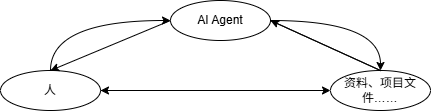

# 在AI Agent辅助下完成项目的方法论

>小学语文老师教先读首段尾段和每段第一句，我觉得不符合认知科学，“挨着读就好了呀”；\
>中学英语老师教阅读技巧，我觉得有点虚伪，“挨着读就好了呀”；\
>高三时语文老师分类讲不同文本的阅读方法，我觉得很多余，“挨着读就好了呀”；虽然会慢一些，我相信，水到渠成；
>
>……直到我开始学习工科，直到出现了大模型，直到自由泛舟不能应对千帆竞速……我读不懂各种文件，也用不明白vibe coding，才意识到阅读技巧的科学需要琢磨。
>
>*下以完成项目为导向

### 利其器

工欲善其事，必先利其器。首先要用好的大语言模型和智能体。对于我等白痴，开个会员，值。

### 读

我们很自然地认为，AI是人的外挂数据库的超级检索工具。对于不得不需要AI Agent辅助才能完成的项目，一般来说，最大的困难在于信息向人的输入，而AI的用意是减小信息冗余与加速检索，提高效率。

“信息输入”要从人直接读取资料文件等开始，在读取的过程中决策AI Agent的参与。那么，读的方法与决策的方法是我们要具体化的事情。

人读要读关键文档。项目中的readme、项目结构、专门给人看的手册要根据工作通读或挑着读。期间借助AI做解释。当然也可让AI读再让他讲给你——如果你信得过的话——不用ai的原因一方面是没必要，另一方面是避免信息损失。

不具备所读文献思路或者可能我们需求的东西需要那种遍历才能发现的局部来提供的时候，要通读文献；若要复现论文，一定不能忽视包含实验细节的附录。

通读文献，从“读到的东西”而论，不是一定要挨着读，而要学会分层管理（越深的层理解上越连续，与已有认知的连接度越多），允许类似于宽度优先搜索，先读到一层离散的“意义”，然后再根据读完这一层“意义”后得到的考量来决定如何深入读哪些意义的下一层。

如果任务仓促，英文阅读或许是一道槛，kimi翻译全文还算好用，不用充钱。

深入读取时，我们会考虑需求、顺序、程度，有些需要读，有些不需要读，有些重脉络，有些重原理，有些重技术实现……还要考虑自己直接读还是交给ai读。

ai有两个作用，一个是检索文件之外的信息，一个是综述文件内的信息；利用ai检索未知信息的时机与方法都比较自然（建议小量的文本可以即时检索，大量的文本可以完成一层工作后在下面的层做检索），而后者就是我们“交给ai读”时它发挥的作用。虽然最后我们不难发现，两者起作用时的本质都可以概括为检索我们未知的信息。

考虑自己直接读还是交给ai读之前，我们需要先明白为什么要读？有些时候，阅读无非是从字句汪洋中找到特定的答案，这时候，我们给ai设问，让它根据文件作答，就会方便很多。

难的概念和思路我们还可以把学后的理解讲给ai，相互审计，以赛诸葛。

### 做

#### 做中的读
智能体解决环境问题很方便。但是相比可以人肉解决问题的人，依赖ai还是慢了很多。关键是在Agent运行的过程中，如果人不能真正参与，则使思维停摆，又因需要频繁给反馈，并行其他工作也不现实，长此以往，深感前额叶的功能受损。在项目中，由于文件目录的整体迁移等情况，相同的配置问题可能会多次出现，在Agent解决后，知道他做了哪些操作，在**文件**的结构层次上理解这个机理，可以避免我们做重复的Prompt生成器，既提效，又能渐有收获。**推而广之，使用agent时，不能只面向结果迭代，还要关注原理。**，可以通过向Agent提问实现，__“文件、数据流、程序流程(写清楚调用的api和功能)、依赖与只读资源”__ 是理解原理的个人感觉好用的提示词。

在一个利用智能体完成高于自己知识水平的项目中，时间实际上是花在了对智能体在该项目上能力的评估与自己对这部分的了解双向奔赴的过程。而后者奔赴的距离相较整个项目的知识体量其实可怜。

在已有的较高质量项目的基础上进行的时候，意识到其经过了封装可以省些功夫。可以只关注接口的用法，出现错误可以顺藤摸瓜。这些可以通过询问agent来提高阅读寻找的效率，__“api、暴露的api”__ 是好用的提示词。

#### 做中的做

对ai agent下达的命令，可以分为两类：令执行；令解决（令给出解决方法并执行）。

使用的ai工具中，可以分为两类结合使用：一类是善于思考的模型，用于分析优化，一类是善于长文本的模型，用于planning与coding（比如cursor的auto模式）。可以把后者遇到的情景交给前者分析，然后让前者给出prompt。而后者通过长上下文得到的信息或给出的方案，可以交给前者，由前者审计、优化。自然，前者的方案可能也许后者在长上下文背景下审计。

在使用ai时，也要利用分层的思想，因为ai的注意力只会延对话进行单线索地叠加。以上面的第二类ai工具为例，可以并行多个会话，其中一个维护着从阅读到各个任务板块的项目主线，一个专用于某个板块内部，一个用于一些微调，另一个用于分析硬件配置与算力问题之类。

借助Agent完成项目主线时，prompt可能需要点明：
>1. 利用的知识出处（可能需要下载到工作区）
>2. 项目基础（若有）
>3. 项目意图
>4. 个人分析与偏好
>5. 允许开发的目录
>6. “未经允许不能改动xx之外的部分”
>7. “先讲解你的方案” ----- <后续进入**读**的环节>
>8. 环境（虚拟环境、是否连网等）
>9. 留痕

prompt的核心思想是换位思考：如果你什么都不知道，别人该告你什么你才能完成你现在要做的事。

对于跑大规模的数据，非常需要多添加监控输出，这是ai的长处，他会有很多输出反馈和多线程监控的花样，但你需告诉ai。初步要先确保能跑通，好调试，之后在减少I/O以节省运行耗时。回显进度条的\<tqdm\>库有一点好用，但在多进程上可能会出问题。

在运行过程中如果为分析性能、提高性能或者增加回显，__“一直卡着”__ 是好用的提示词。

借助agent迭代修正中需要谨慎的是，它可能会忘却所依据的方法理论。为了进行眼下的修补，可能会使用自创的方法。为了避免弄乱我们的技术流，需要对每种他给出的解决的方法审计，或者在请它解决前添加好方法的约束，譬如基本方法出处。

【更新中，完全基于个人的不堪的经验，还望批评指点】
### 尾声
自主的借助AI的学习、实践、研究相比有指南或师授，在方向上显得茫然，在详略上显得无错。现在，你或可以上面的分层思维来把握整体，选择性地致微。

悉达多进入陌生的领域时，他说：“我会思考、等待、斋戒”。这里或许也是适用的。“思考”在说不明朗中也要始终尝试去想；“等待”在讲和ai连通信息时的耐心；“斋戒”在说不要为无关的诱惑打断，坚持在等待中思考，从而在思考中洞察。

以及，好奇心，一直是灵敏而强韧的风帆。

 
 
 
 
 

>献给被浪费的岁月

