# ICS II
## Outline
1. OS + Network
    1. OS: 
        - 核心任务是对硬件资源的封装和虚拟化
        - 计算资源--进程
        - 内存资源（易失性）--虚拟内存
        - 外存资源（非易失性）-- 文件系统
    2. Books
        1. OS: Three Easy Pieces
        - Virtualization 
            - CPU：CSAPP第8章《异常流控制（进程）》
            - Memory: CSAPP第9章《虚拟存储器》
        - Concurrency: CSAPP第12章《并发编程》
        - Persistence: CSAPP第10章《I/O与文件系统》和OSTEP Persistence部分
        2. Network:
        - TCP/IP协议栈
        - 套接字（Socket）编程：CSAPP第11章《网络编程》
    
2. Labs:
    - ShellLab
    - SchedLab
    - MallocLab
    - FSLab
    - NetLab
    (往年，今年待定)
3. 期中28%+课堂练习&作业7%+Labs35%+期末30%
4. Linux常用性能调优工具: https://www.slideshare.net/slideshow/linux-performance-analysis-and-tools/16739605
    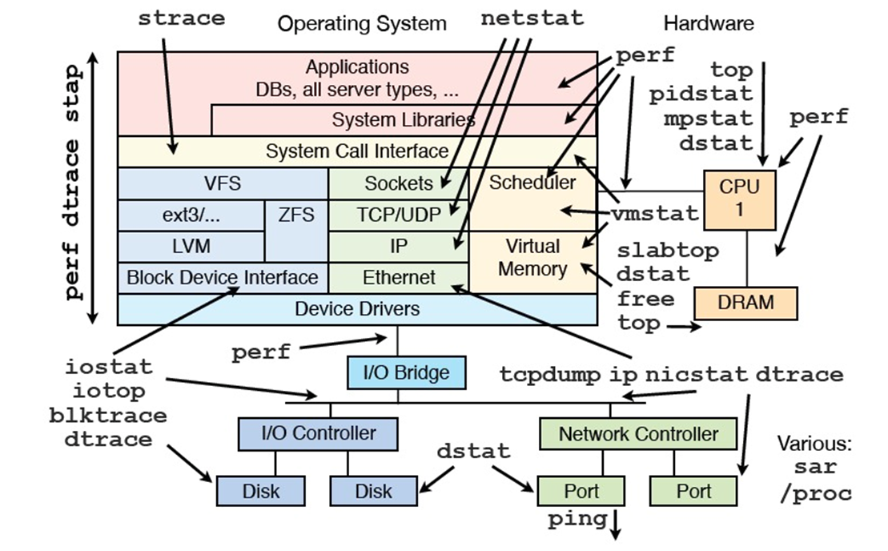

## OS Introduction
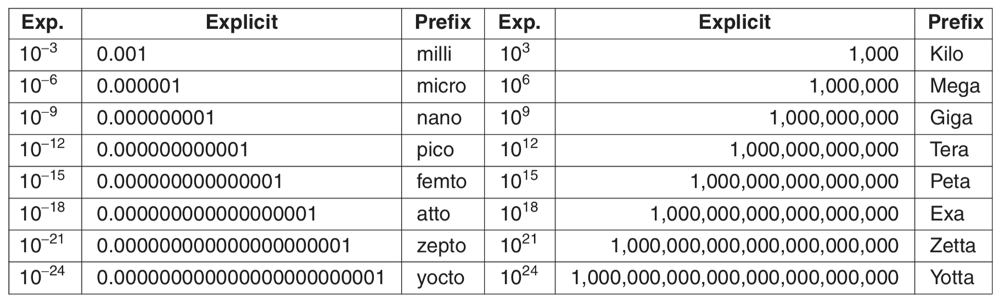
## Exceptional Control Flow I
1. Control flow (控制流)
    从开机到关机，CPU的工作流程是固定的：
    ```c
    While(1) {
        读指令;
        执行指令;
    }
    ```
    从而形成的指令序列就是系统的physical control flow
    - 改变的方法：
        - Jumps and branches
        - Call and return using the stack discipline
    - 多任务(multitasking)系统中必须解决的问题：如何高效地在进程之间切换control flow
    - 此外，一些外部事件需要CPU改变control flow
2. ECF: 可能突变的控制流称为异常控制流（exceptional control flow, ECF）,从当前program的控制流中突然跳出，转到其他指令
3. Exceptions: 在OS中是指原本的Sequencial Control Flow的突然改变，这种改变是由于CPU状态的改变(event)导致的
    - 和编程语言(如C++、Java)中的Exception不是一个东西
   
   1. Exception Table
    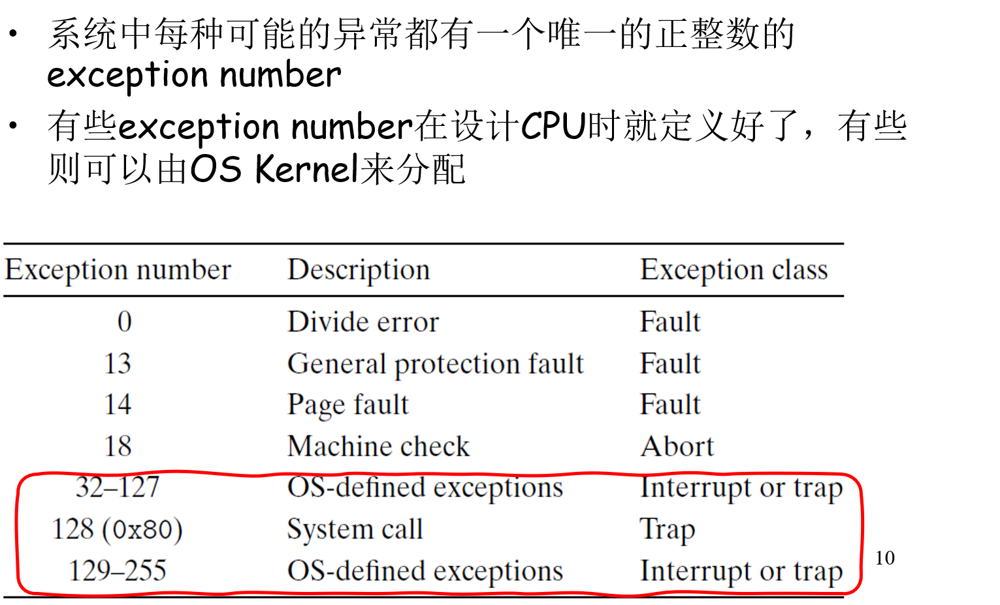
    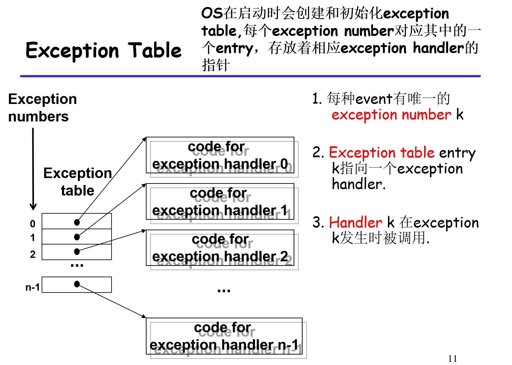
    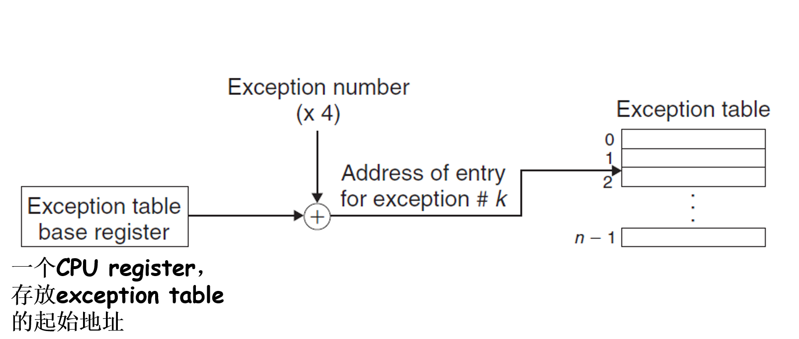
    如果是64位机则 $\times 8$ 

   2. Exception Handler
     - Exception handler由OS装载，运行在kernel mode，拥有系统中的最高权限 $\rightarrow$ Exception时control flow会在user mode和kernel mode之间切换(transfer)，即进出内核。
    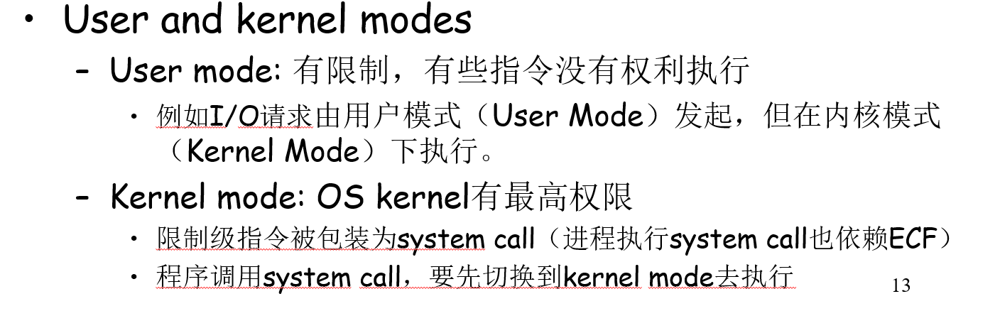
   3. 分类：
    1. __中断（interrupt）__:
        - 来自CPU外部，如I/O设备等硬件
        - 异步发生（与指令不对齐，__任何时间都可能发生__）
        - CPU有专门的硬件管脚(pin)接受中断请求
        - 对应的exception handler也叫interrupt handler
        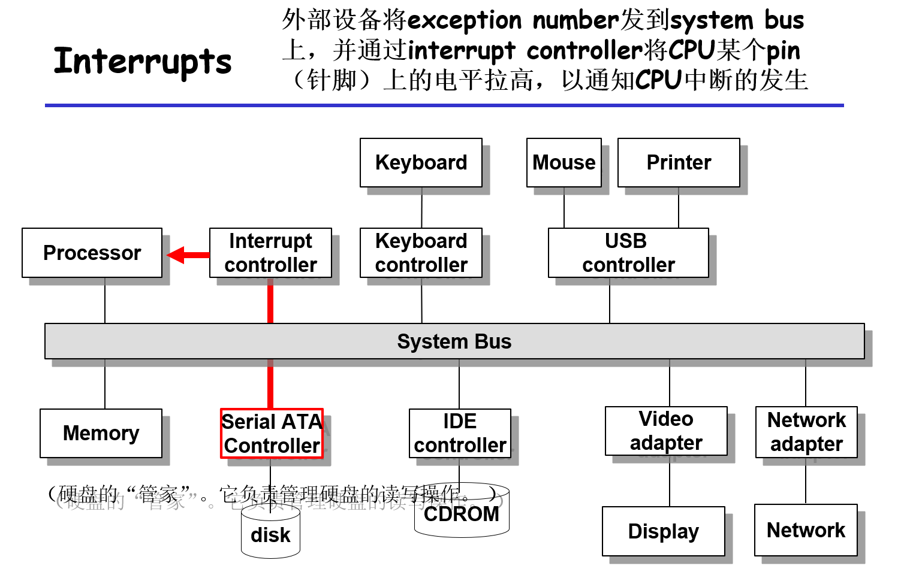
        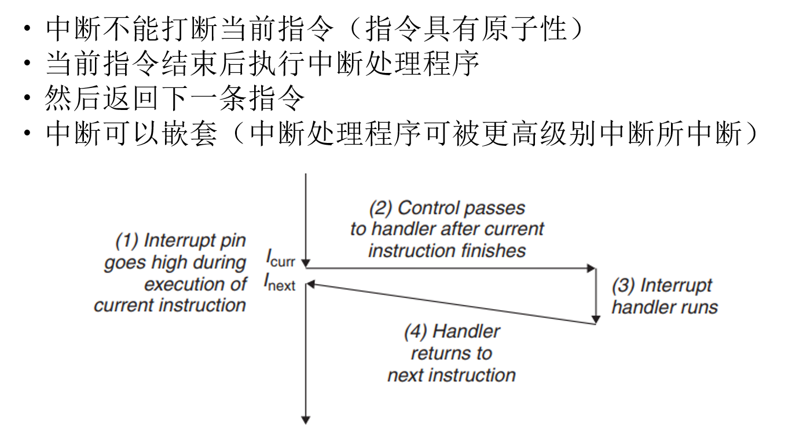
    2. __陷阱（trap）__
        - 有意的异常，是执行一条特殊指令（syscall或int指令）的结果，是同步发生的
        - 也叫做software interrupt
        - trap最重要的用途是在用户程序和内核之间提供一种接口，即系统调用（system calls）
        - 与中断处理类似，执行完陷阱处理程序后，会返回当前程序的下一条指令
        - 每个system call有一个由OS定义的syscall number
        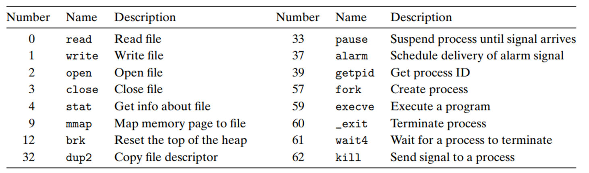
        x86中所有的system call都通过syscall(现代)或int n(老派)指令触发，调用的参数由rax寄存器保存。与Call不同，System call=升级权限+跳转
        Linux在启动时在kernel space中会创建一个类似于exception table的查找表，用于根据syscall number查找syscall handler的入口
        - 与Call不同，System call=升级权限+跳转：
            1）系统调用和函数调用很像，主要区别是进入内核态
            2）系统调用没法指定目标函数的地址，只能传递一个syscall number给内核
        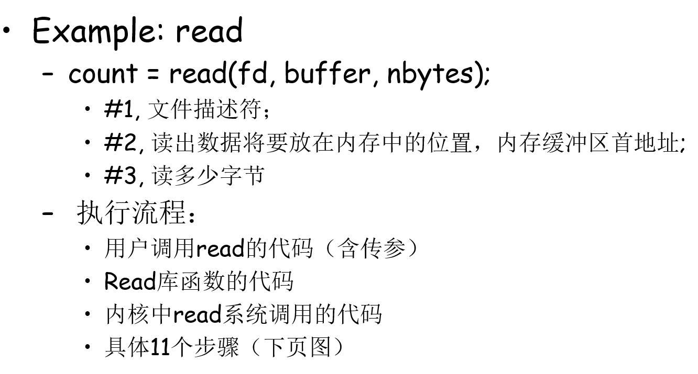
        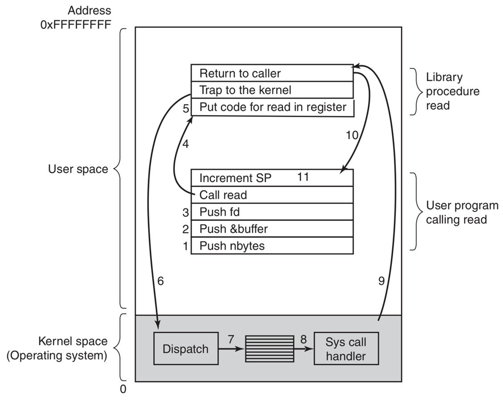
        
    3. __故障（fault）__
        - 系统中一种有可能被修正的error
        - 故障由某条指令的执行引发，因此也是同步发生的
        - 相应的exception handler也称为fault handler
        - 故障发生时，处理器将控制转移给fault handler
            如果能够修复故障，那么返回引起故障的指令，并重新执行
            如果不能修复故障，就返回到内核中的abort routine(例程)，abort routine会终止引起故障的应用程序。

            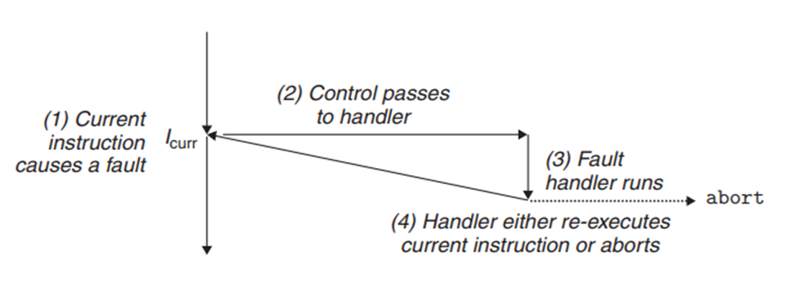
        - __Page fault__

        User writes to or reads from memory location. That portion (page) of user’s memory is currently on disk. Page fault handler must load page into physical memory. Returns to faulting instruction（出错的指令）. Successful on second try.
        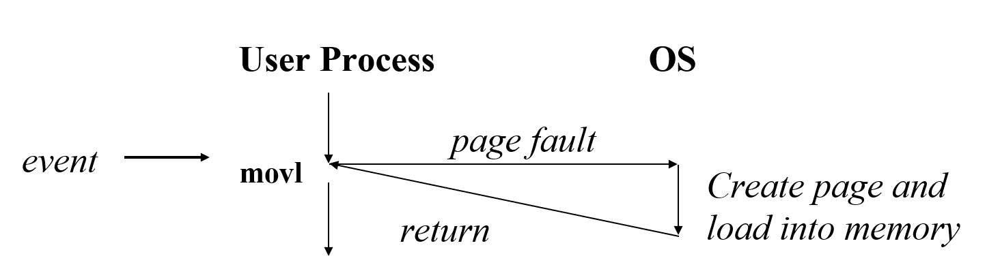
        
        User writes to memory location. Address is not valid. Page fault handler detects invalid address. Sends SIGSEG signal to user process. User process exits with “segmentation fault”.        

        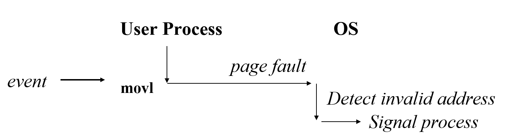
        
        
    4. __终止（abort）__
        - 不可修复的错误导致
        - 一般是硬件错误，比如DRAM或SRAM中的位被损坏时发生的奇偶校验错误
        - 不会将控制权返回给应用程序，而是终止该程序
        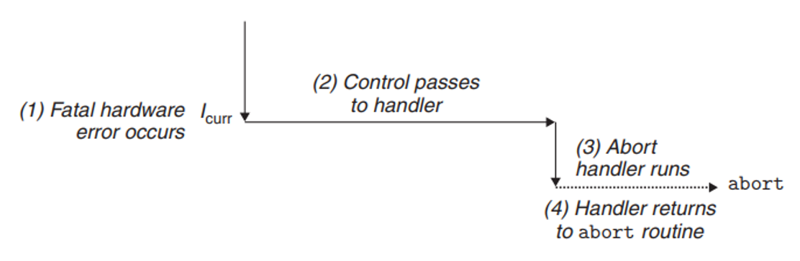

4. Processes:
    A process is an instance of a running program.
    
    - Process给每个程序提供两个关键的抽象：
        - 逻辑控制流(logical control flow): 让每个进程感到自己是独自使用CPU的
        - 私有的地址空间(private address space): 让每个进程感到自己是独自使用整个内存的

5. User and Kernel Modes
    - Kernel: Processes are managed by a __shared__ chunk of OS code called the kernel. Important: the kernel is not a separate process, but rather runs as part of some user process. 
    - CPU的某个control register中有一个mode bit. mode bit置位是，进程处于kernel mode; 否则，进程处于user mode.
    - 运行在kernel mode的进程能够 执行CPU指令集中的任何指令，能否访问系统中的任何内存地址（物理地址访问）
      运行在user mode的进程既不能执行特权指令，也不能直接访问地址空间中kernel区域的数据和代码。
    - 一个运行应用代码的进程初始状态是在user mode
    - 一个进程从user mode变到kernel mode的唯一方法是exception
    - 每个进程的内核态空间是物理上一块空间的映射，Linux中所有进程/线程都共享同一块内核地址空间；用户态空间则各自在物理上彼此隔离，不过，memory mapped region for shared libraries也是从由公共部分映射得到的
    - Linux在启动时会创建一个pid(process id)为0的特殊进程，该进程会创建pid为1的init进程和pid为2的kthreadd进程init是所有用户进程的父进程。
      kthreadd是所有内核线程的父进程
        - 内核线程（也叫内核任务）运行在kernel mode，具有特权。没有用户地址空间，共享同一个内核地址空间。约等于内核进程。一般周期性执行，例如磁盘高速缓存的刷新、网页连接的维护、页面换入换出
        
        Linux中线程是作为lightweight process实现的，有独立的pid，只是share（而不是copy-on-wirte）父进程的地址空间
    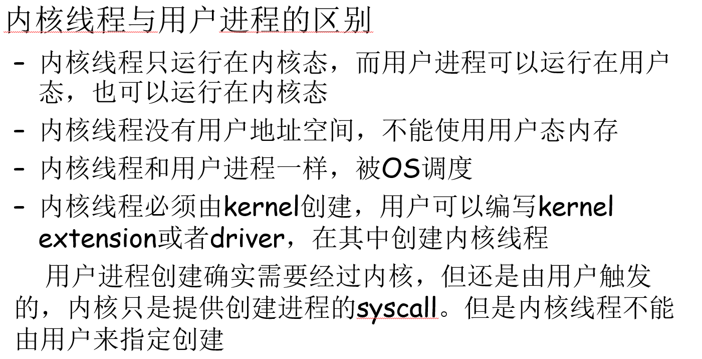
6. Context switching： 指进行多任务切换（例如通过时间片）的机制，保存当前进程A的context，恢复另一个进程B的context，将CPU控制权转交给B
    - Kernel维护了每个进程的上下文（context）
    - Context：
        进程在恢复运行一个进程时所需要的所有状态信息。It contains：
        - the program’s code and data stored in memory
        - its stack
        - the contents of its general-purpose registers
        - its program counter
        - environment variables
        - and the set of open file descriptors 
    - 发生时机：
        - 执行system call
            
            read, sleep , etc. which will cause the calling process blocked
            即使一个system call并不会block进程，kernel代码也要进行一次context switch（只要发生system call，都要强制触发context switch）

        - 发生Interrupt
            - 最常见的是时间片轮转中的Timer interrupt
            - I/O设备完成操作发生中断
        - 发生Fault
            如常见的page fault

        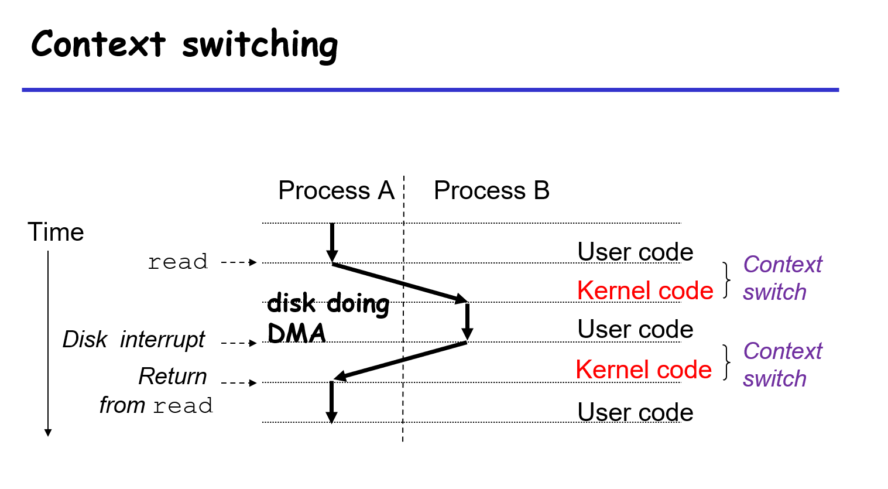

    - Scheduler（一部分kernel代码）会按照如下方法来执行调度：
        - 在执行一个进程的代码时，决定是否要抢占当前进程
        - 选择一个之前被抢占的进程(scheduled process)
        - 抢占当前进程
            - 保存当前进程的上下文
        - 重启scheduled process
            - 恢复scheduled process的上下文
            - 将控制权交给新恢复的进程
        - 选择scheduled process的方法叫CPU调度算法
        将在后面单独讲解
        
7. System Call Error Handling
    - typically, 错误的返回值为-1
    - 设置全局变量 errno, to indicate what went wrong
