# ICS II
## Outline
1. OS + Network
    1. OS: 
        - 核心任务是对硬件资源的封装和虚拟化
        - 计算资源--进程
        - 内存资源（易失性）--虚拟内存
        - 外存资源（非易失性）-- 文件系统
    2. Books
        1. OS: Three Easy Pieces
        - Virtualization 
            - CPU：CSAPP第8章《异常流控制（进程）》
            - Memory: CSAPP第9章《虚拟存储器》
        - Concurrency: CSAPP第12章《并发编程》
        - Persistence: CSAPP第10章《I/O与文件系统》和OSTEP Persistence部分
        2. Network:
        - TCP/IP协议栈
        - 套接字（Socket）编程：CSAPP第11章《网络编程》
    
2. Labs:
    - ShellLab
    - SchedLab
    - MallocLab
    - FSLab
    - NetLab
    (往年，今年待定)
3. 期中28%+课堂练习&作业7%+Labs35%+期末30%
4. Linux常用性能调优工具: https://www.slideshare.net/slideshow/linux-performance-analysis-and-tools/16739605
    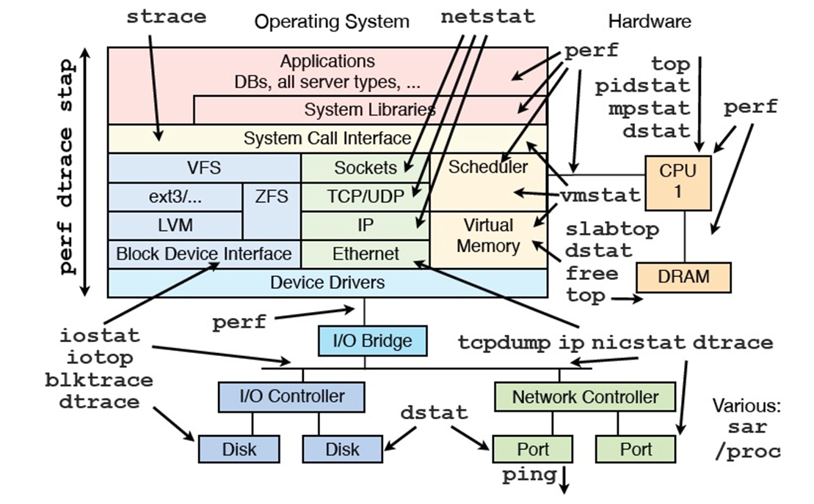

## OS Introduction
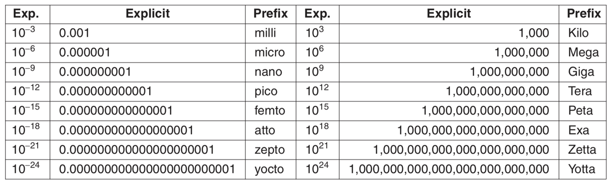
## Exceptional Control Flow I
1. Control flow (控制流)
    从开机到关机，CPU的工作流程是固定的：
    ```c
    While(1) {
        读指令;
        执行指令;
    }
    ```
    从而形成的指令序列就是系统的physical control flow
    - 改变的方法：
        - Jumps and branches
        - Call and return using the stack discipline
    - 多任务(multitasking)系统中必须解决的问题：如何高效地在进程之间切换control flow
    - 此外，一些外部事件需要CPU改变control flow
2. ECF: 可能突变的控制流称为异常控制流（exceptional control flow, ECF）,从当前program的控制流中突然跳出，转到其他指令
3. Exceptions: 在OS中是指原本的Sequencial Control Flow的突然改变，这种改变是由于CPU状态的改变(event)导致的
    - 和编程语言(如C++、Java)中的Exception不是一个东西
   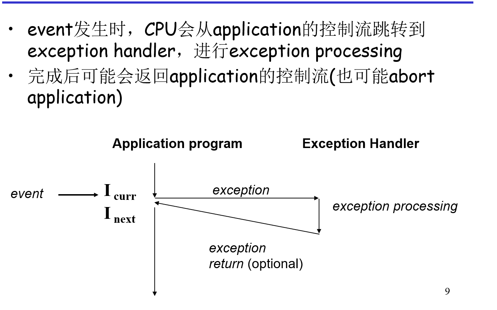
   1. Exception Table
    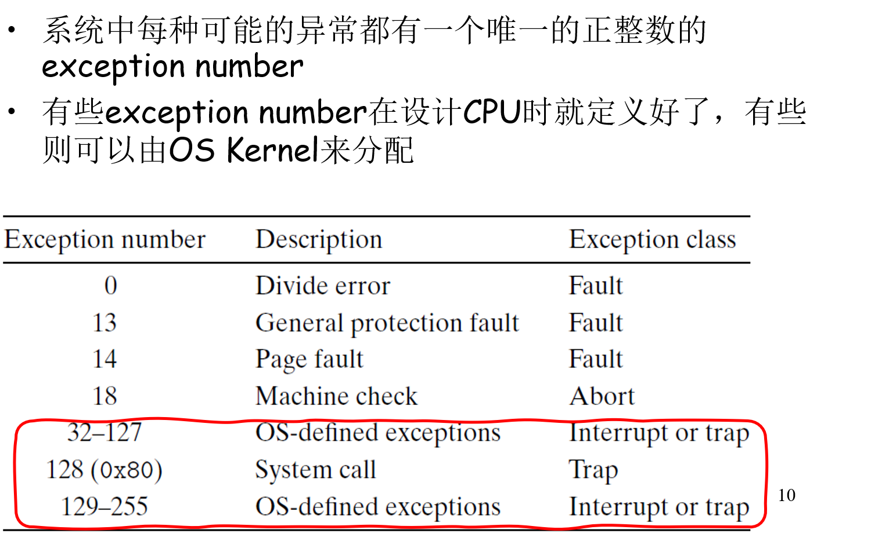
    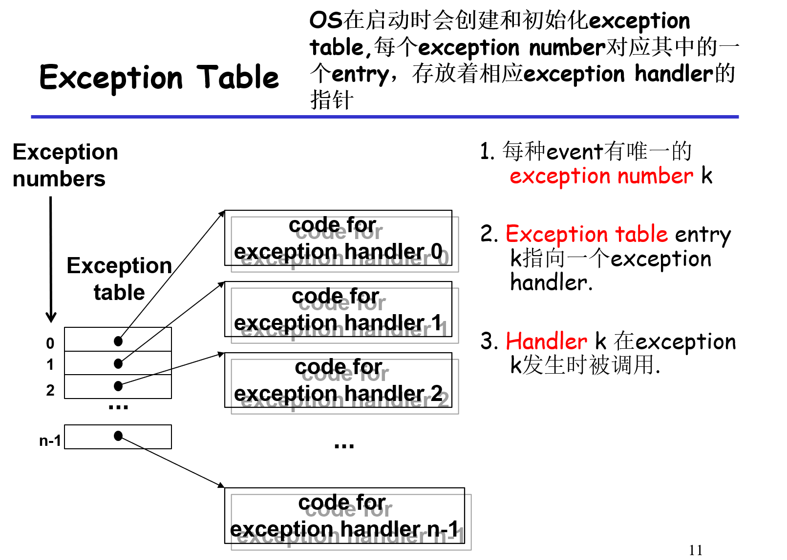
    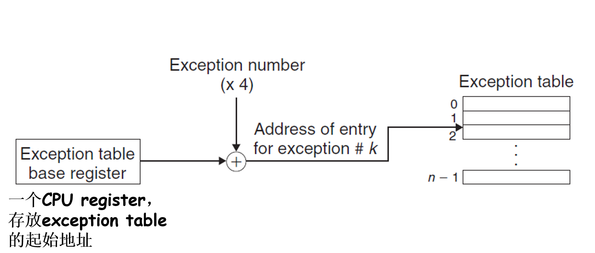
    如果是64位机则 $\times 8$ 

   2. Exception Handler
     - Exception handler由OS装载，运行在kernel mode，拥有系统中的最高权限 $\rightarrow$ Exception时control flow会在user mode和kernel mode之间切换(transfer)，即进出内核。
    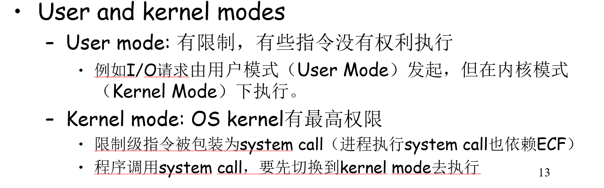
   3. 分类：
    1. __中断（interrupt）__:
        - 来自CPU外部，如I/O设备等硬件
        - 异步发生（与指令不对齐，__任何时间都可能发生__）
        - CPU有专门的硬件管脚(pin)接受中断请求
        - 对应的exception handler也叫interrupt handler
        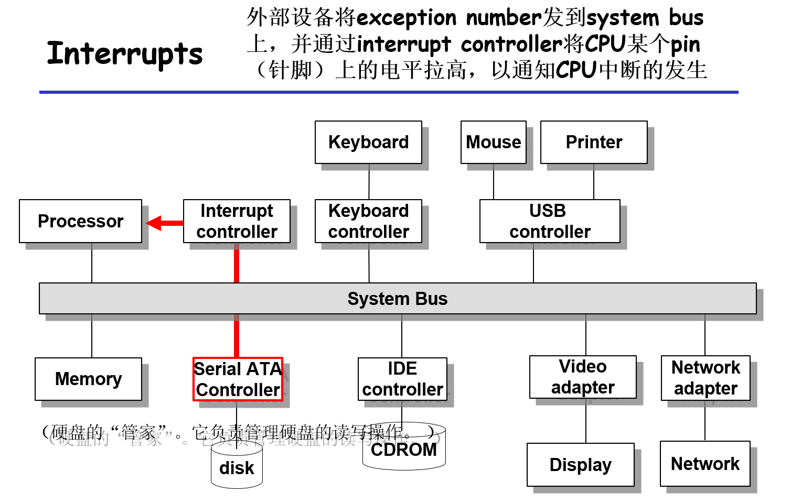
        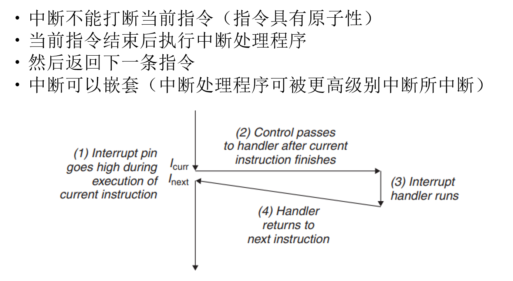
    2. __陷阱（trap）__
        - 有意的异常，是执行一条特殊指令（syscall或int指令）的结果，是同步发生的
        - 也叫做software interrupt
        - trap最重要的用途是在用户程序和内核之间提供一种接口，即系统调用（system calls）
        - 与中断处理类似，执行完陷阱处理程序后，会返回当前程序的下一条指令
        - 每个system call有一个由OS定义的syscall number
        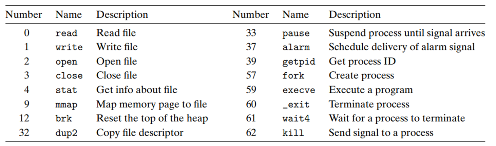
        x86中所有的system call都通过syscall(现代)或int n(老派)指令触发，调用的参数由rax寄存器保存。与Call不同，System call=升级权限+跳转
        Linux在启动时在kernel space中会创建一个类似于exception table的查找表，用于根据syscall number查找syscall handler的入口
        - 与Call不同，System call=升级权限+跳转：
            1）系统调用和函数调用很像，主要区别是进入内核态
            2）系统调用没法指定目标函数的地址，只能传递一个syscall number给内核
        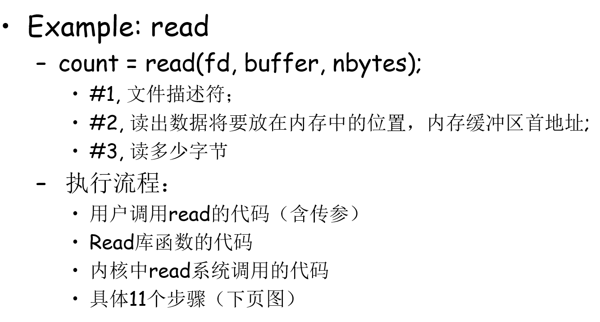
        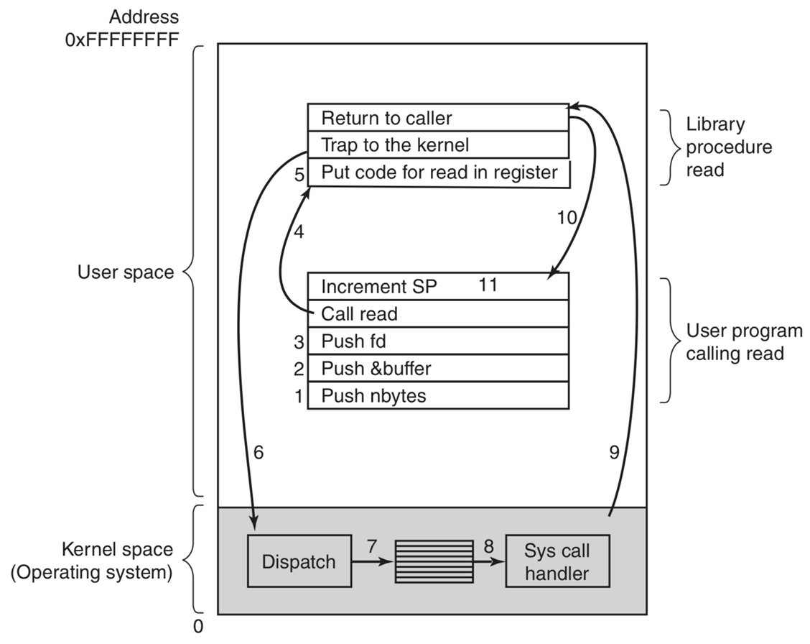
        
    3. __故障（fault）__
        - 系统中一种有可能被修正的error
        - 故障由某条指令的执行引发，因此也是同步发生的
        - 相应的exception handler也称为fault handler
        - 故障发生时，处理器将控制转移给fault handler
            如果能够修复故障，那么返回引起故障的指令，并重新执行
            如果不能修复故障，就返回到内核中的abort routine(例程)，abort routine会终止引起故障的应用程序。

            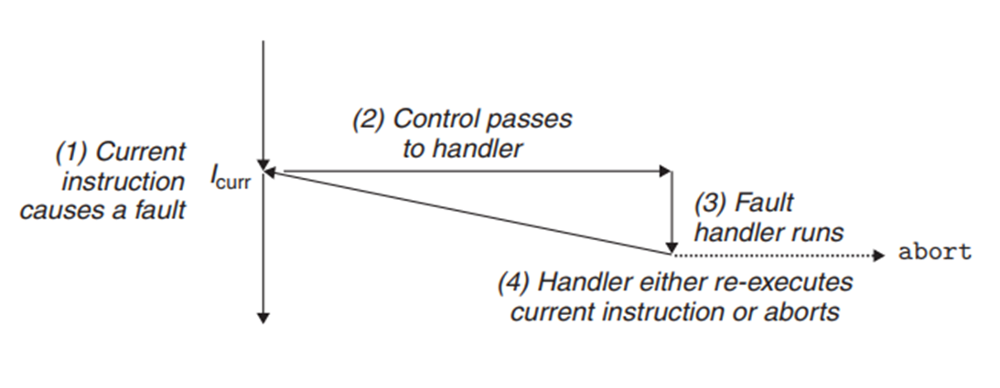
        - __Page fault__

        User writes to or reads from memory location. That portion (page) of user’s memory is currently on disk. Page fault handler must load page into physical memory. Returns to faulting instruction（出错的指令）. Successful on second try.
        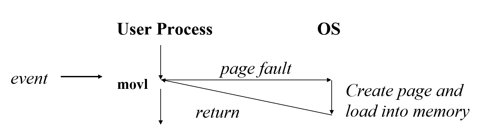
        
        User writes to memory location. Address is not valid. Page fault handler detects invalid address. Sends SIGSEG signal to user process. User process exits with “segmentation fault”.        

        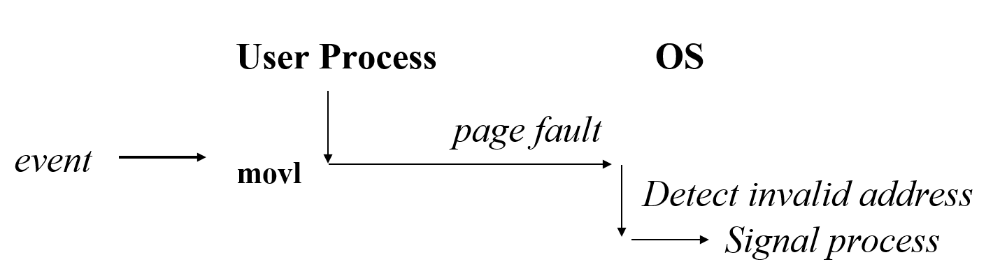
        
        
    4. __终止（abort）__
        - 不可修复的错误导致
        - 一般是硬件错误，比如DRAM或SRAM中的位被损坏时发生的奇偶校验错误
        - 不会将控制权返回给应用程序，而是终止该程序
        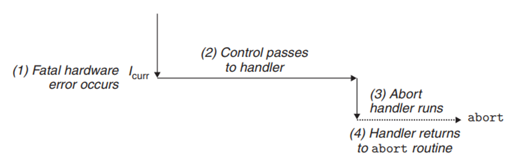

4. Processes:
    A process is an instance of a running program.
    
    - Process给每个程序提供两个关键的抽象：
        - 逻辑控制流(logical control flow): 让每个进程感到自己是独自使用CPU的
        - 私有的地址空间(private address space): 让每个进程感到自己是独自使用整个内存的
    - 【石】状态： 运行、等待、就绪 --> 进程管理
    - 并发（存在都开始未结束的过程）、并行（真正同时）
5. User and Kernel Modes（__硬件的机制__）
    - Kernel: Processes are managed by a __shared__ chunk of OS code called the kernel. Important: the kernel is not a separate process, but rather runs as part of some user process. 
    - CPU的某个control register中有一个mode bit. mode bit置位是，进程处于kernel mode; 否则，进程处于user mode.
    - 两位不能由软件改的bit 来决定状态, 0 内核态， 3 用户态
    - 运行在kernel mode的进程能够 执行CPU指令集中的任何指令，能否访问系统中的任何内存地址（物理地址访问）
      运行在user mode的进程既不能执行特权指令，也不能直接访问地址空间中kernel区域的数据和代码。
    - 一个 __运行应用代码的进程__ 初始状态是在user mode
    - 一个进程从user mode变到kernel mode的唯一方法是exception
    - 每个进程的内核态空间是物理上一块空间的映射，Linux中所有进程/线程都共享同一块内核地址空间；用户态空间则各自在物理上彼此隔离，不过，memory mapped region for shared libraries也是从由公共部分映射得到的
    - 一部分指令集只能在内核态执行，叫做“特权指令”
    - Linux在启动时会创建一个pid(process id)为0的特殊进程，该进程会创建pid为1的init进程和pid为2的kthreadd进程init是所有用户进程的父进程。
      kthreadd是所有内核线程的父进程
        - 内核线程（也叫内核任务）运行在kernel mode，具有特权。没有用户地址空间，共享同一个内核地址空间。约等于内核进程。一般周期性执行，例如磁盘高速缓存的刷新、网页连接的维护、页面换入换出
        
        Linux中线程是作为lightweight process实现的，有独立的pid，只是share（而不是copy-on-wirte）父进程的地址空间
    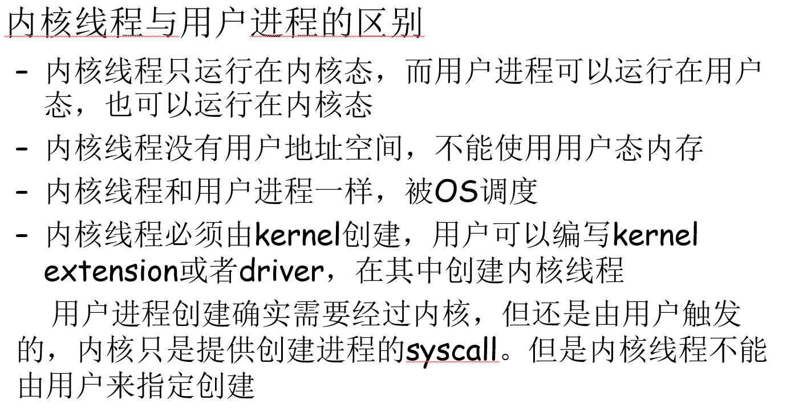
6. Context switching： 指进行多任务切换（例如通过时间片）的机制，保存当前进程A的context，恢复另一个进程B的context，将CPU控制权转交给B
    - Kernel维护了每个进程的上下文（context）
    - Context：
        进程在恢复运行一个进程时所需要的所有状态信息。It contains：
        - the program’s code and data stored in memory
        - its stack
        - the contents of its general-purpose registers
        - its program counter
        - environment variables
        - and the set of open file descriptors 
    - 发生时机：
        - 执行system call
            
            read, sleep , etc. which will cause the calling process blocked
            即使一个system call并不会block进程，kernel代码也要进行一次context switch（只要发生system call，都要强制触发context switch）

        - 发生Interrupt
            - 最常见的是时间片轮转中的Timer interrupt
            - I/O设备完成操作发生中断
        - 发生Fault
            如常见的page fault

        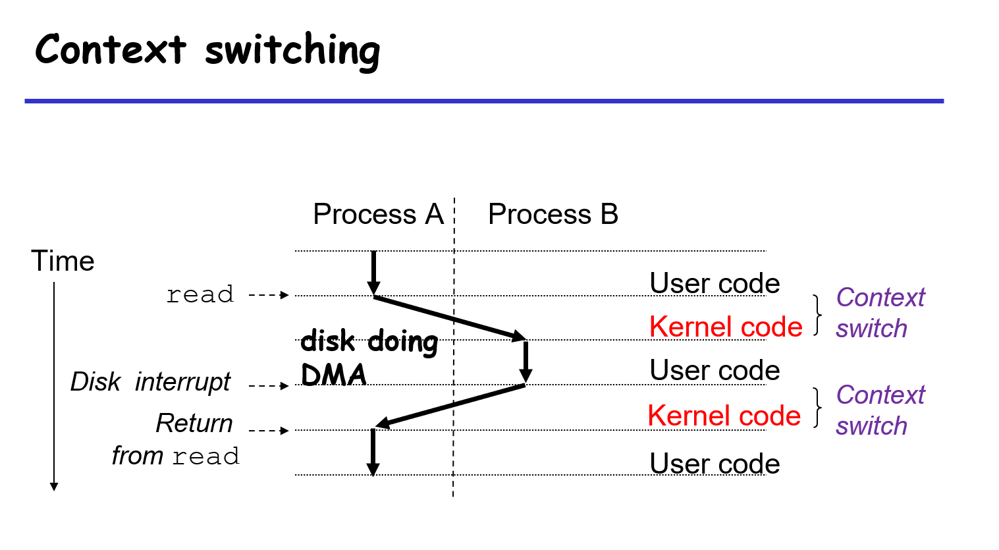

    - Scheduler（一部分kernel代码）会按照如下方法来执行调度：
        - 在执行一个进程的代码时，决定是否要抢占当前进程
        - 选择一个之前被抢占的进程(scheduled process)
        - 抢占当前进程
            - 保存当前进程的上下文
        - 重启scheduled process
            - 恢复scheduled process的上下文
            - 将控制权交给新恢复的进程
        - 选择scheduled process的方法叫CPU调度算法
        将在后面单独讲解
    
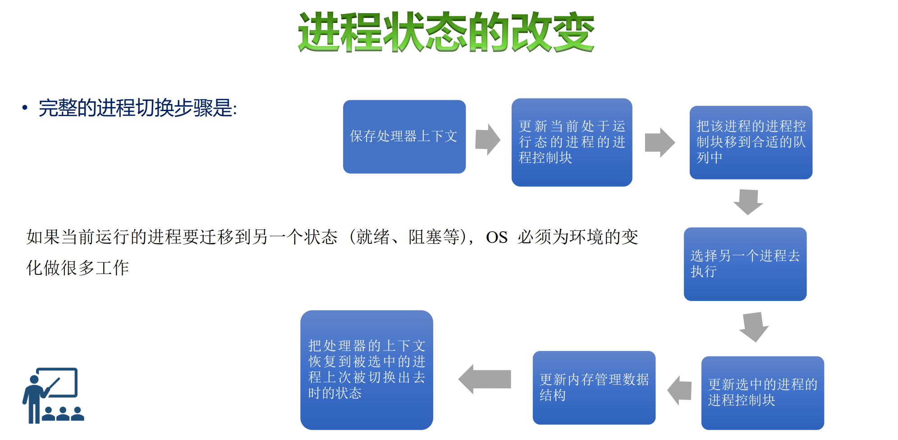

7. System Call Error Handling
    - typically, 错误的返回值为-1
    - 设置全局变量 errno, to indicate what went wrong


## Exceptional Control Flow II (Process Operations)
1. Process id
每个进程有一个唯一的正整数PID，可以重用，所以在整个timeline上不是唯一的
```c
#include <unistd.h>
#include <sys/types.h>
pid_t getpid(void);  //获取当前进程的pid
pid_t getppid(void); //获取当前进程的父进程的pid
```
- pid_t：在types.h中定义，Linux中就是int

2. States of a Process（较为通用，接近linux，但是是较为抽象的通用归纳）
- New (新建)：进程正在初始化
- Running (运行)：进程正在CPU上执行
- Ready (就绪)：进程等待被执行，且迟早(也许一万年)会被调度执行
- Stopped (暂停)：进程暂停执行，且永远都不会被调度(除非转为Ready)
- Blocked (阻塞)：进程等待外部事件(如I/O完成)而停止执行，且永远都不会被调度(除非事件完成、转为Ready)
- Terminated (终止)：进程永久停止执行 
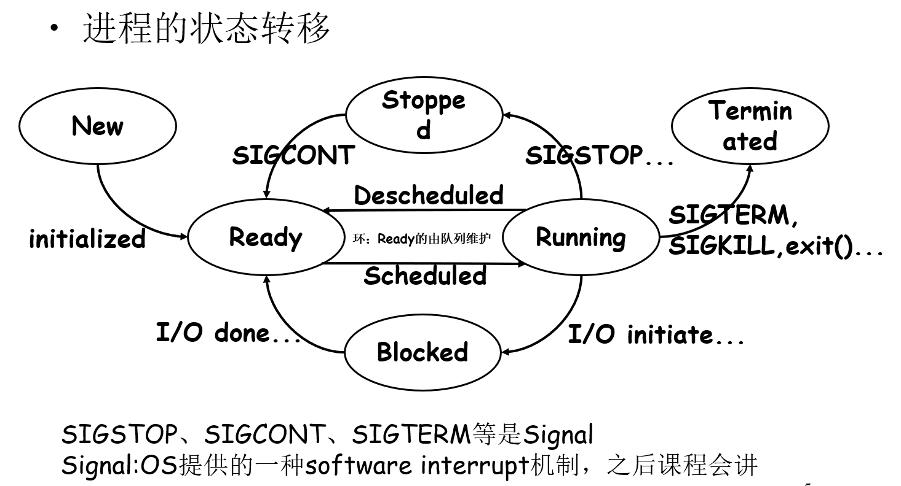
其他转换：
Running状态之外的stopped、Ready进程可以被终止，Blocked可能会屏蔽信号而无法被终止
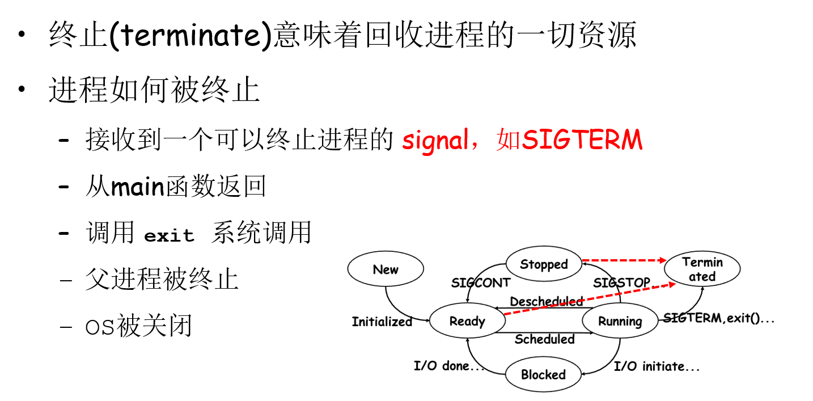
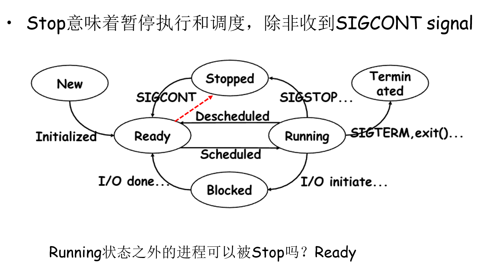
进程不能直接从Blocked或Stopped状态进入Running状态
必须先进入Ready状态，等待OS调度

- 考虑虚拟内存：
    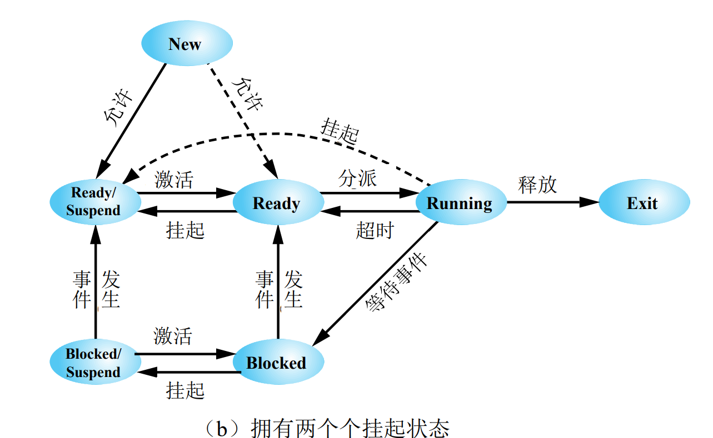
    $Ready \rightarrow Suspend$ 的情况：所有进程就绪。但内存不够用了。
    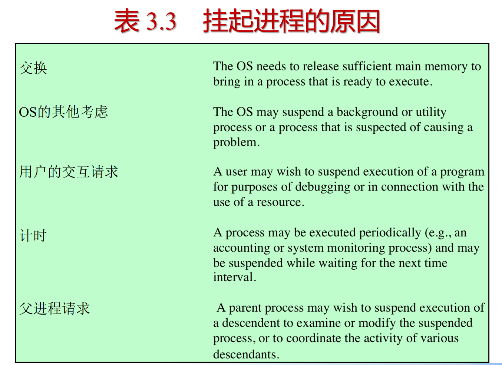

    - 挂起的过程涉及到交换（Swapping）


- Linux进程状态（通常是用户进程的情况）
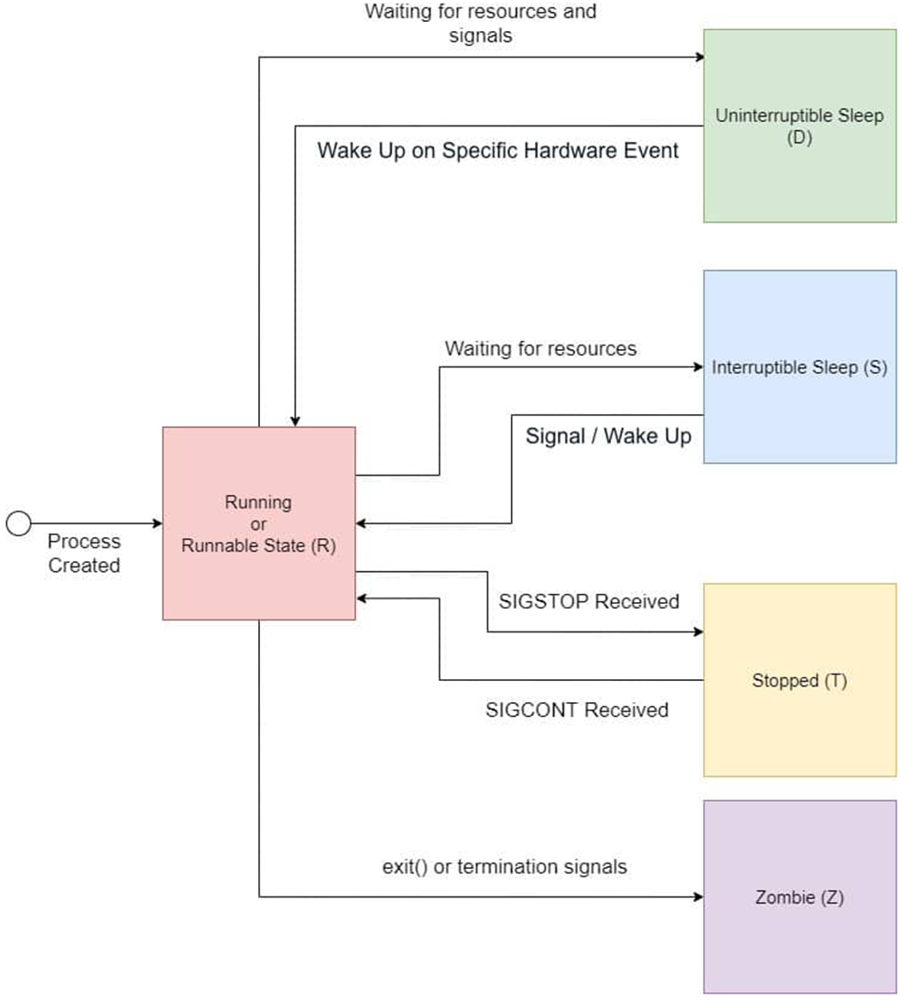
(S和D相应于Block)
Linux 4.14之后，内核线程有一个额外的状态I (idle)，相当于用户进程的S状态。
    - 查看进程的指令：top、ps

3. Thread
在同一个进程空间的多个指令流（控制流），共享很多进程资源，变量可以互相访问，切换开销较小（将在“并行”部分详细介绍）
- Linux上的线程是通过共享地址空间的进程实现的，线程相当于lightweight process，被内核调度。从CPU调度器来讲进程和线程是一样的。
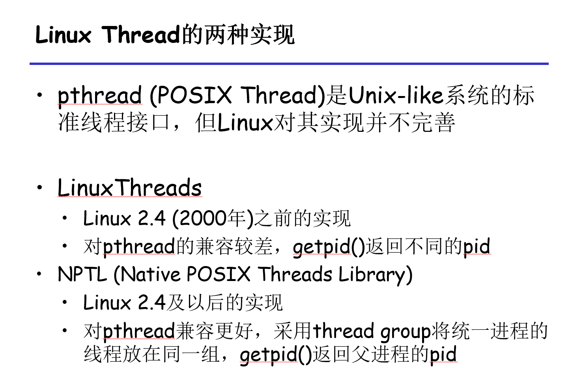

4. 创建和初始化进程
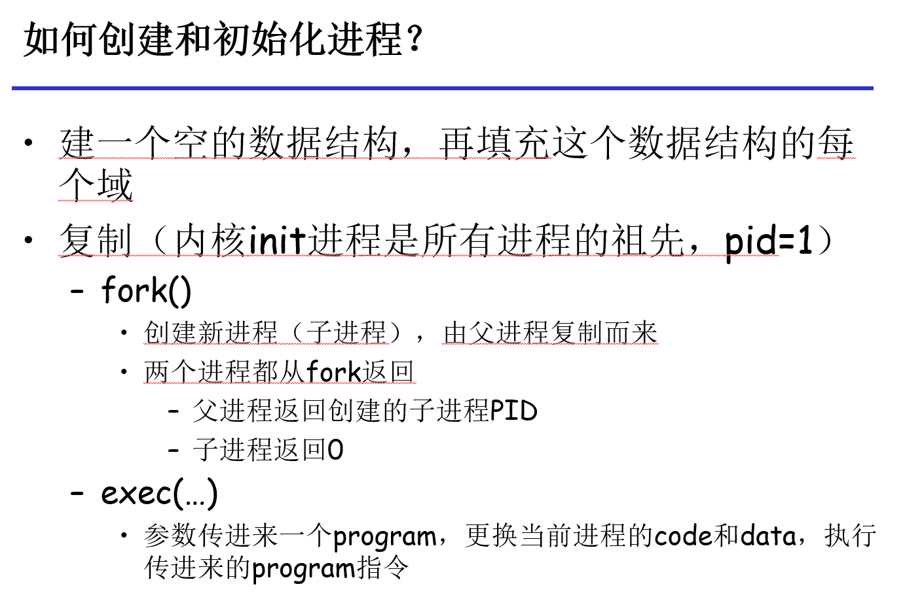
（建一个空的数据结构，再填充每个域?）
```c
\\Fork
#include <unistd.h>
#include <sys/types.h>
pid_t fork(void);//Returns: 0 to child, PID of child to parent, -1 on error

```
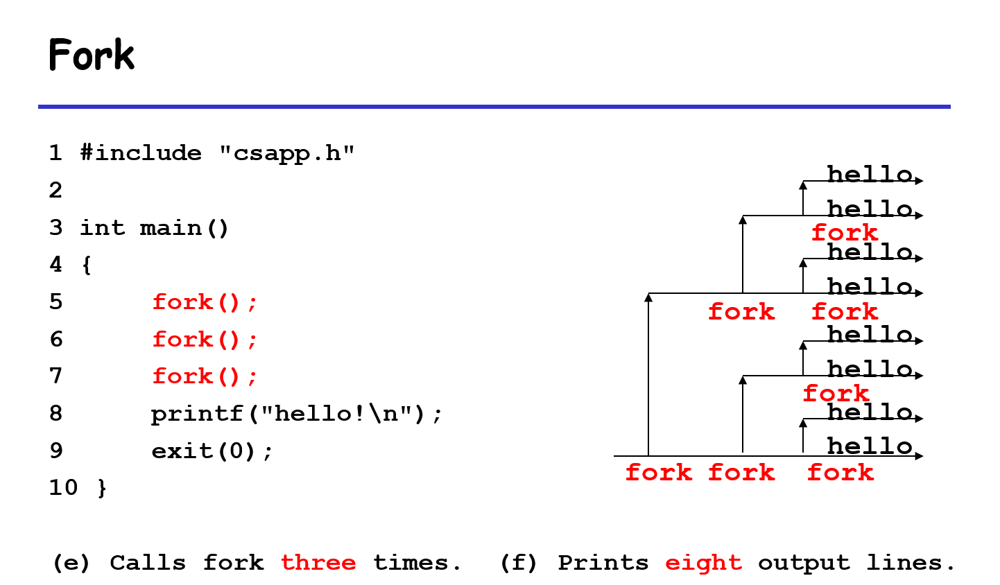
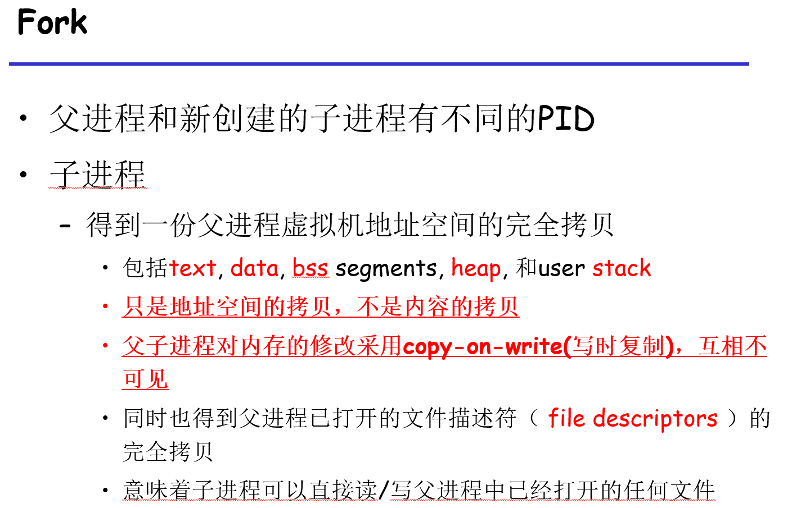
- PCB
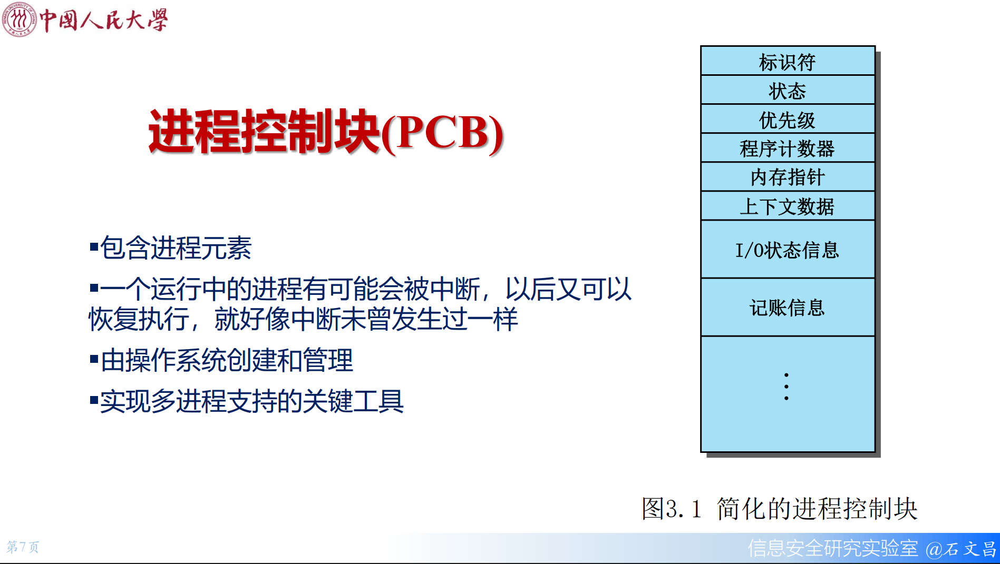

    存在内核的部分。
    操作系统维护一张表，每一项就是一项PCB，标识符就是他的索引。在初始化时就会分配空间、确定最多有多少项，从而确定最多能有几个进程。操作系统启动前管理员可以根据硬件情况来配置。
    
    在进程执行过程中，内存指针经常发生变化。

    进程结束后表项会释放，可供再分配。

 - Concurrent execution: 逻辑控制流中的指令可以由内核以任意方式进行交错执行

5. Zombie
    - Kernel并不会在进程终止后立刻将其清理掉。已终止的进程一般会保持在terminated状态，直到被其parent收割（reaped）
    - 父进程收割已终止的子进程时 内核首先把子进程的exit status发送给父进程，然后抛弃已经终止的进程
    - __已终止但未被收割的进程称为zombie进程__
        - 如果父进程退出时没有收割zombie子进程，这些zombie将由init 进程负责收割

    - 长期运行的程序，例如shells或servers（除非特别说明，是指一个进程，而非计算机），应该总是收割他们的 __zombie子进程__。因为即使zombie不在运行，没有消耗CPU资源，他们也消耗了系统的内存资源。
    
6. init process 
- PID为1 
- 由内核在启动时创建;除非OS关闭，否则永远不会终止

7. Wait_pid ———— 进程如何等待子进程终止？
```c
#include <sys/types.h>
#include <sys/wait.h>
pid_t waitpid(pid_t pid, int *status, int options);//Returns: PID of child if OK, 0 (if WNOHANG) or -1 on error
pid_t wait(int *status);
//wait(&status)是waitpid的简化版，相当于waitpid(-1, &status, 0);
```

参数：
- pid：
    - > 0 等待pid为该值的子进程终止并被收割；
    - =-1 等待pid为该值的子进程终止并被收割
- options
    -  = 0
        - waitpid的调用进程进入挂起状态，直到它的wait-set中的一个child process终止了；
        - 如果wait-set中的一个进程在进行waitpid调用的时候已经终止了，那么waitpid立刻返回；
        
        Waitpid返回已经终止的child process的PID
    - WNOHANG: 
        - 如果wait-set中的任何子进程都还没有终止，那么立即返回，返回值为0
        - 如果在等待子进程终止的过程的同时，还希望做些有用的工作，这个选项会有用
    - WUNTRACED: 
        - 将调用waitpid的进程挂起，直到wait-set中的一个子进程已经变成已终止或者被停止。返回已终止或已停止的子进程PID
    
    - Default option：
    仅当子进程终止时返回
    - WCONTINUED: 
    将调用waitpid的进程挂起，直到wait-set中的一个正在运行的子进程终止，或者等待集合中一个被停止的进程收到SIGCONT信号重新开始。
    - WUNTRACED | WNOHANG : 
    立刻返回。如果等待集合中的进程都没有被停止或终止，则返回0；如果有一个停止或终止，则返回该进程的PID

    - Options是状态字，32位，每位代表一种配置
- status: 用于查看被收割子进程的退出状态，为non-NULL(非空指针) 

    __wait.h 中定义了一些 帮助解析status的宏__:
    - WIFEXITED(status)

        - Returns true if the child terminated normally
            - via a call to exit or a return.
    - WEXITSTATUS(status)

        Returns the exit status of a normally terminated child. 
        This status is only defined if __WIFEXITED__ returned true.  

    - WIFSIGNALED(status)

        Returns true if the child process terminated because of a __signal__ that was not caught
    - WTERMSIG(status)

        Returns the number of the signal that caused the child process to terminate. 
        This status is only defined if WIFSIGNALED returned true.
    

    - WIFSTOPPED(status)

        Returns true if the child that caused the return is currently __stopped__.
    - WSTOPSIG(status)

        Returns the number of the signal that caused the child to stop. 
        This status is only defined if __WIFSTOPPED__ returned true.
    - WIFCONTINUED(status)
    
        Returns true if the child was restarted by receipt of a __SIGCONT signal__

    - 指定输出顺序的场景：
        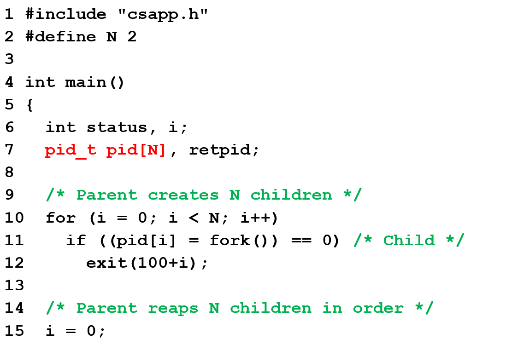
        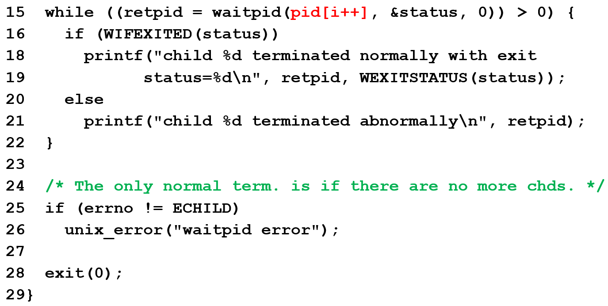

    - Error conditions
    如果当前进程没有子进程
    返回 –1，并设置errno为ECHILD
    如果该函数的执行被signal中断
    返回–1 ，并设置errno为EINTR(?在wait中才会设置)

8. Putting Process to Sleep
```c
#include <unistd.h>
unsigned int sleep(unsigned int secs); //Returns: seconds left to sleep
int pause(void);//Always returns -1
```
sleep
    - 挂起一个进程一段时间；

    - 如果请求的时间量已经到了，则返回0；
        否则返回剩下还要休眠的秒数（如果sleep函数被一个信号中断而过早返回时，会没有休眠足够的时间而提前返回。）
pause
    - 让调用函数的进程休眠，直到该进程收到一个信号
    
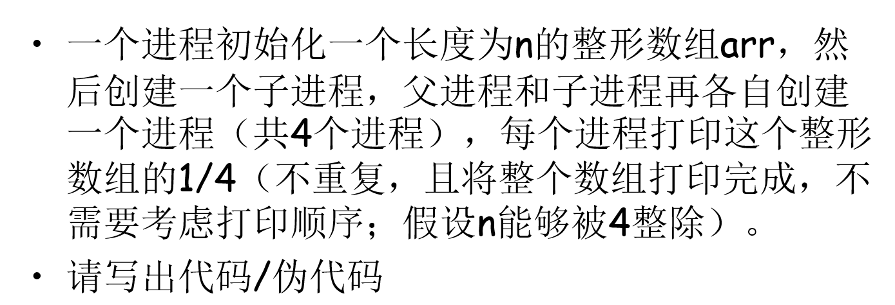 
通过条件分支来使得p0 p1的start有不同
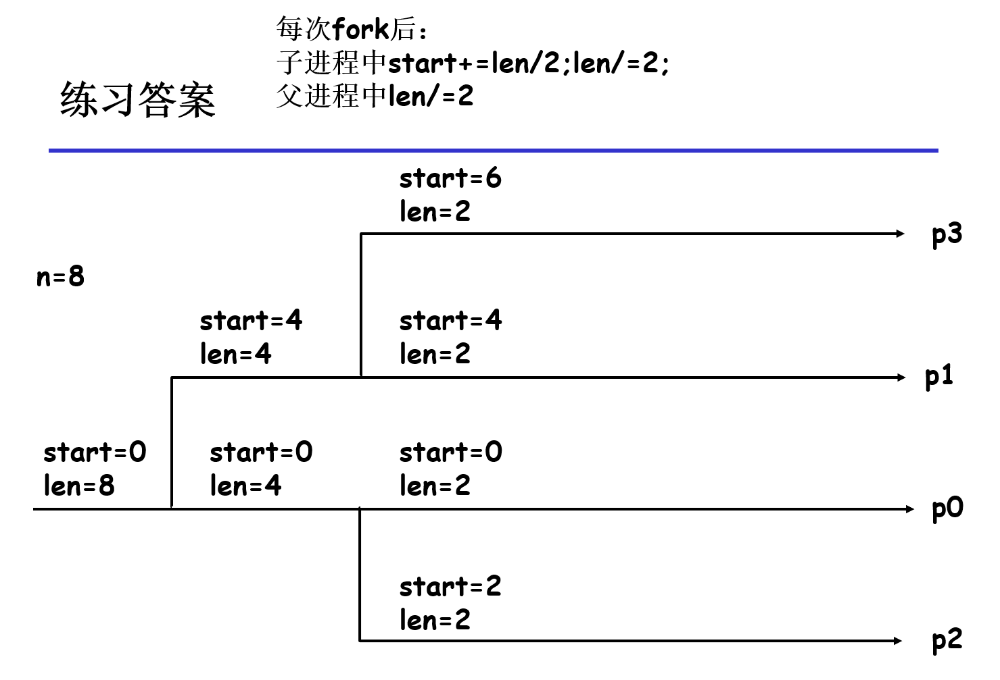


9. 父进程与子进程
- 父进程等待子进程结束：Waitpid()

- 子进程等待父进程结束
    - 轮询（polling）
    
        好处：没有contex switch,节省了这方面的开销。但会一致占用处理器

        ```c
        While (getppid() != 1)//
        sleep(1);
        ```
        - getppid()返回父进程PID，永远成功返回
        - 如果一个父进程在其子进程之前结束了，那么这个子进程就会变成孤儿进程 (Orphan Process)。内核会自动将这个孤儿进程“托付”给 init 进程（PID 为 1）。
    - 或者采用效率更高的信号机制

- 竞争条件
    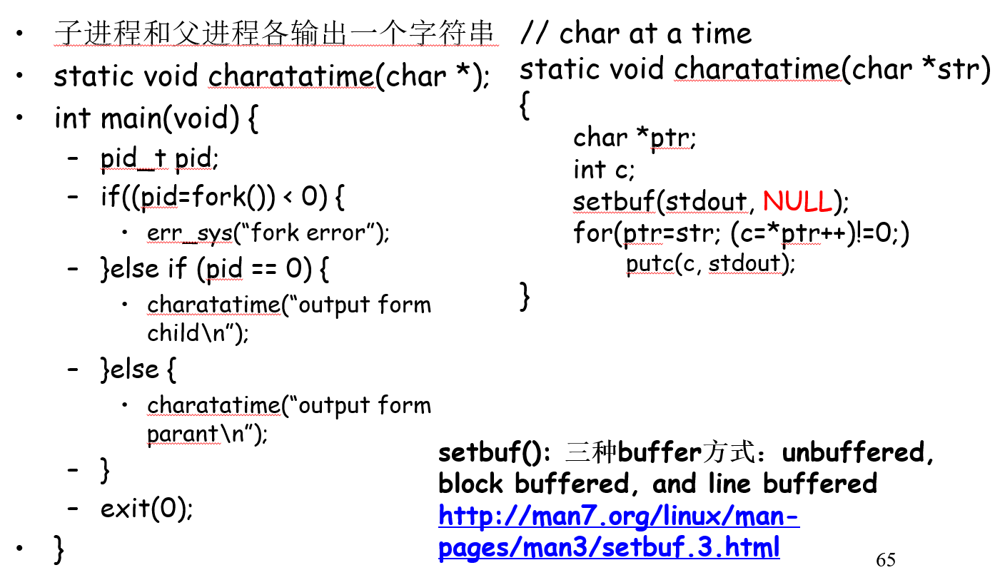
        - ```setbuf(stdout, NULL)``` 关掉了缓冲区。那么一个进程的输出不能确保连续，可能会被其他进程的输出插入。

        - http://man7.org/linux/man-pages/man3/setbuf.3.html
    
    - 先子后父
        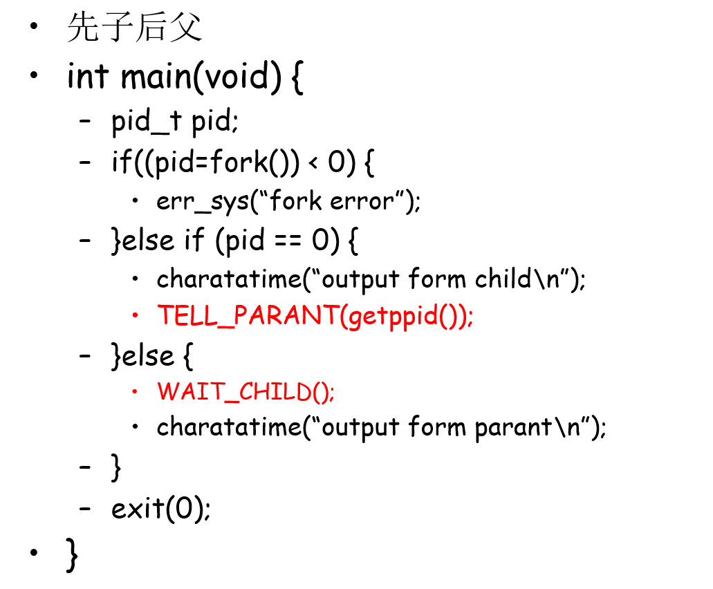
    - 先父后子
        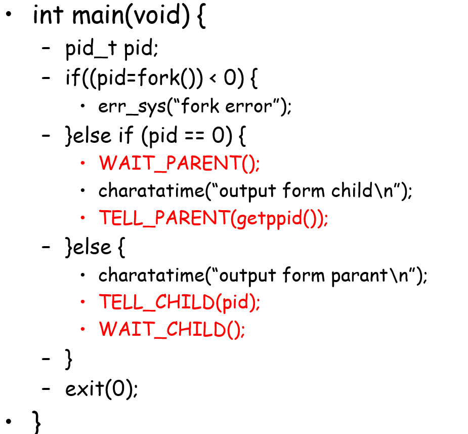
        - 避免了下述情况：
        Shell一行执行多个命令，当父进程结束，就开始执行下一个命令，不管子进程是否执行完。
        因此child的数据会与parent的随机交叉

11. Loading and Running
```c
#include <unistd.h>
int execve(const char *filename, const char *argv[],const char *envp[]);//does not return if OK, returns -1 on error
```
在当前进程中装载一个新程序并运行： 
- 可执行文件 filename 
- argument list argv
- environment variable list envp. 
只有当出错时才返回,例如无法找到 filename. 
The Execve is called once and never returns
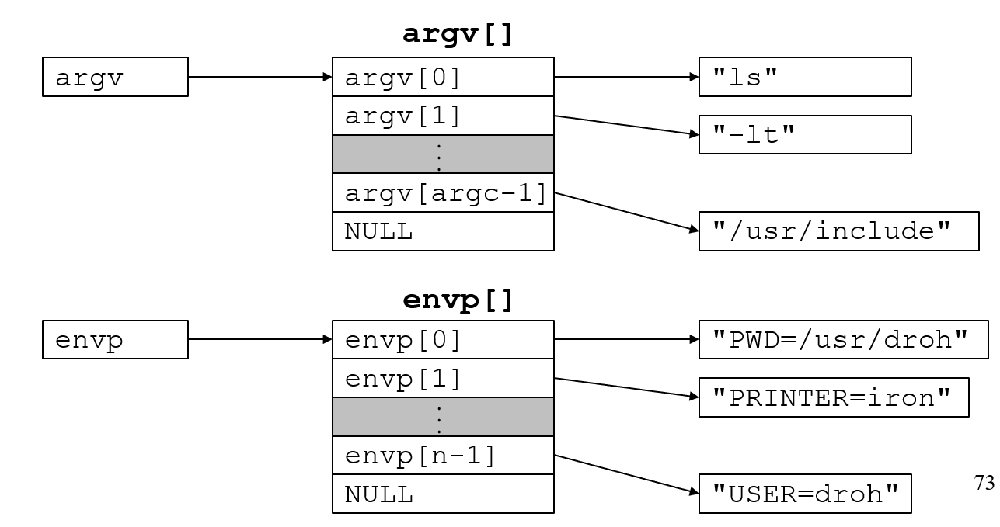
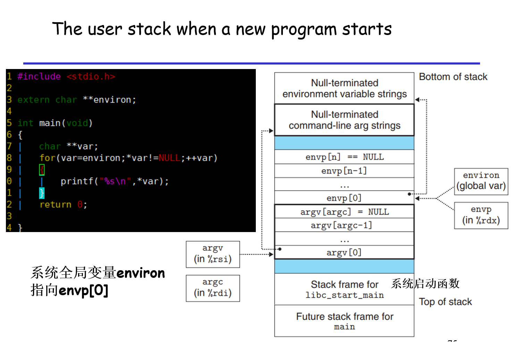

- 修改environment variables
```c
#include <unistd.h>
char *getenv(const char *name); //Returns: ptr to name if exists, NULL if no match.
int setenv(const char *name, const char *newvalue,int overwrite); //Returns: 0 on success, -1 on error.
void unsetenv(const char *name);//Returns: nothing.
```
    - key-value stores  的典型的三种操作: CRUD. Create（增）、Retrieve（查）、Update（改）、Delete（删）

12. Unix Shell
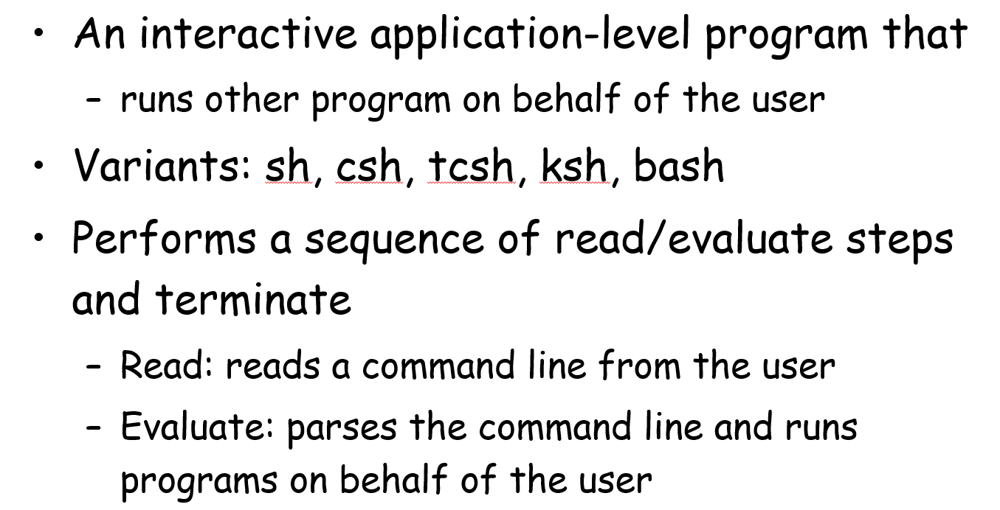
```c
/* The main routine for a simple shell program */
1  #include "csapp.h"
2  #define MAXARGS 128
3
4  /* function prototypes */
5  void eval(char*cmdline);
6  int parseline(const char *cmdline, char **argv);
7  int builtin_command(char **argv);
8
9  int main()
10 {
11   char cmdline[MAXLINE]; /* command line */
12
13   while (1) {
14     /* read */
15     printf("> ");
16     Fgets(cmdline, MAXLINE, stdin);
17     if (feof(stdin))
18       exit(0);
19
20     /* evaluate */
21     eval(cmdline);
22   }
23 }

1  /* eval - evaluate a command line */
2  void eval(char *cmdline)
3  {
4    char *argv[MAXARGS]; /* argv for execve() */
5    char buf[MAXLINE]; /* holds modified cmd line */
6    int bg; /* should the job run in bg or fg? */
7    pid_t pid; /* process id */
8
9    strcpy(buf, cmdline);
10   bg = parseline(buf, argv);
11   if (argv[0] == NULL)
12     return; /* ignore empty lines */
13

/* 
Parses the space separated command-line arguments and builds the argv vector
which will eventually be passed to execve
*/
1  /* parse the cmd line and build the argv array */
2  int parseline(const char *cmdline, char **argv)
3  {
4    char *delim; /* first space delimiter */
5    int argc; /* number of args */
6    int bg; /* background job? */
7
8    buf[strlen(buf)-1] = ’ ’;   /* replace trailing ’\n’ with space */
12   while (*buf && (*buf == ’ ’)) /* ignore spaces */
13     buf++;
14
12    /* build the argv list */
13    argc = 0;
14    while ((delim = strchr(buf, ’ ’))) {
15      argv[argc++] = buf;
16      *delim = ’\0’; /* replace space with ’\0’*/
17      buf = delim + 1;
18      while (*buf && (*buf == ’ ’)) /* ignore spaces */
19        buf++;
20    }
21    argv[argc] = NULL; /* set the end of argv list */
22
23    if (argc == 0) /* ignore blank line */
24      return 1;
25
26    /* should the job run in the background? */
27    if ((bg = (*argv[argc-1] == ’&’)) != 0)
28      argv[--argc] = NULL;
29    return bg;
30 }

```    
- The first argument is assumed to be either the name of a built-in shell command that is interpreted immediately or an executable object file that will be loaded and run in the context of a new child process
（ppt上还有shell实现相关的残缺的模板代码，可以先忽略，可以自己实现后就懂了）

13. Foreground and Background
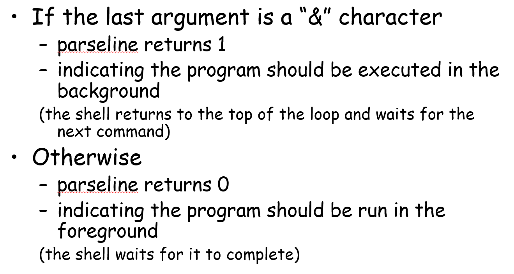
（……for the next command 继续出现提示符，等待输入）
（……wait for it to complete 等程序运行完）

## Signal
1. Signal Terminology
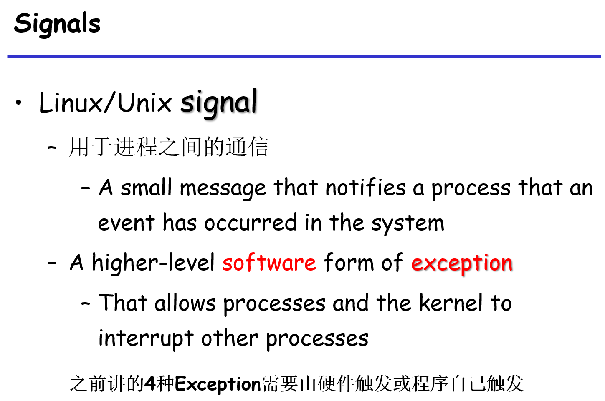
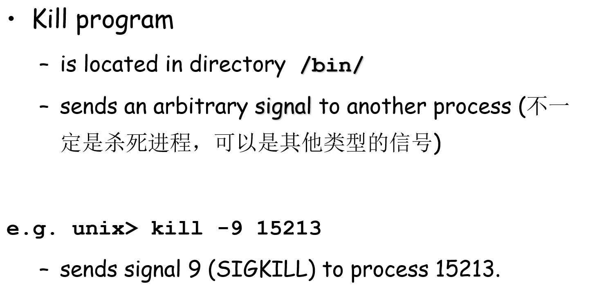
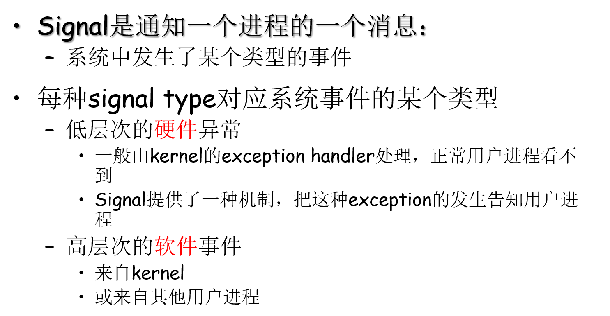
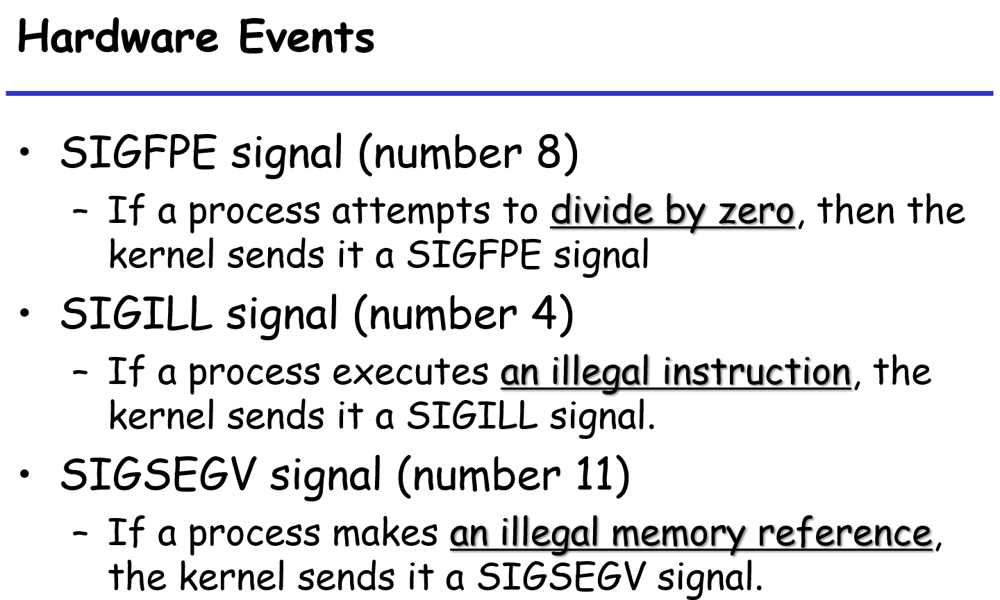
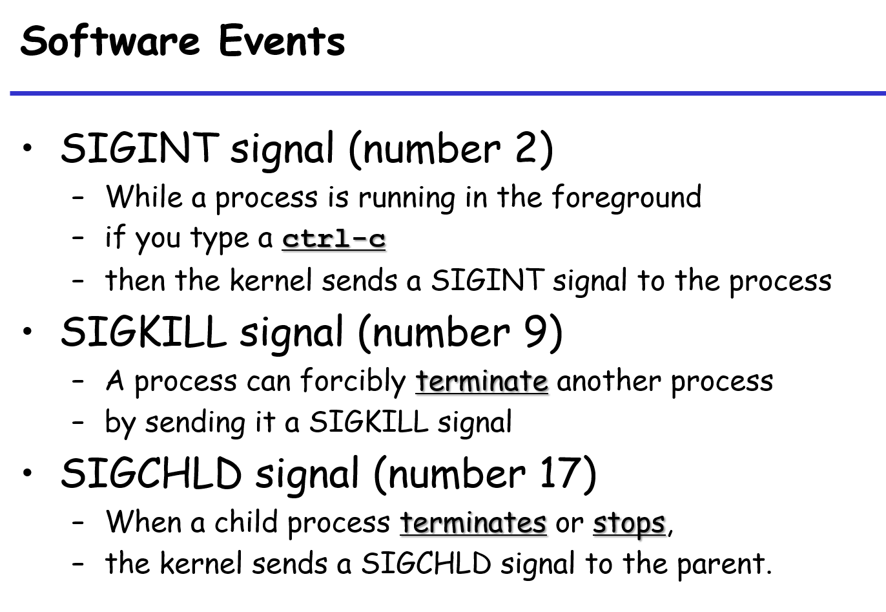
- Linux Signals
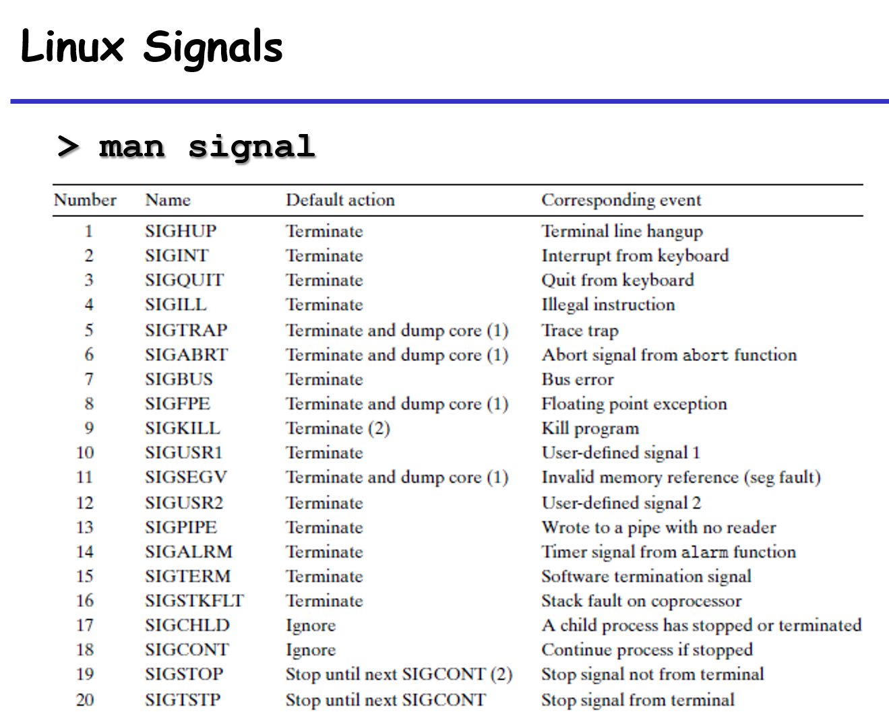
Linux系统共定义了64种信号

https://www.man7.org/linux/man-pages/man7/signal.7.html

- 不可靠信号： 也称为非实时信号，standard signal
    - 不支持排队，信号可能会丢失, 比如发送多次相同的信号, 进程只能收到一次
    - 信号值取值区间为1~31
- 可靠信号： 也称为实时信号，real-time signal
    - 支持排队, 信号不会丢失, 发多少次, 就可以收到多少次
    - 信号值取值区间为32~64
用户可以自定义这些信号
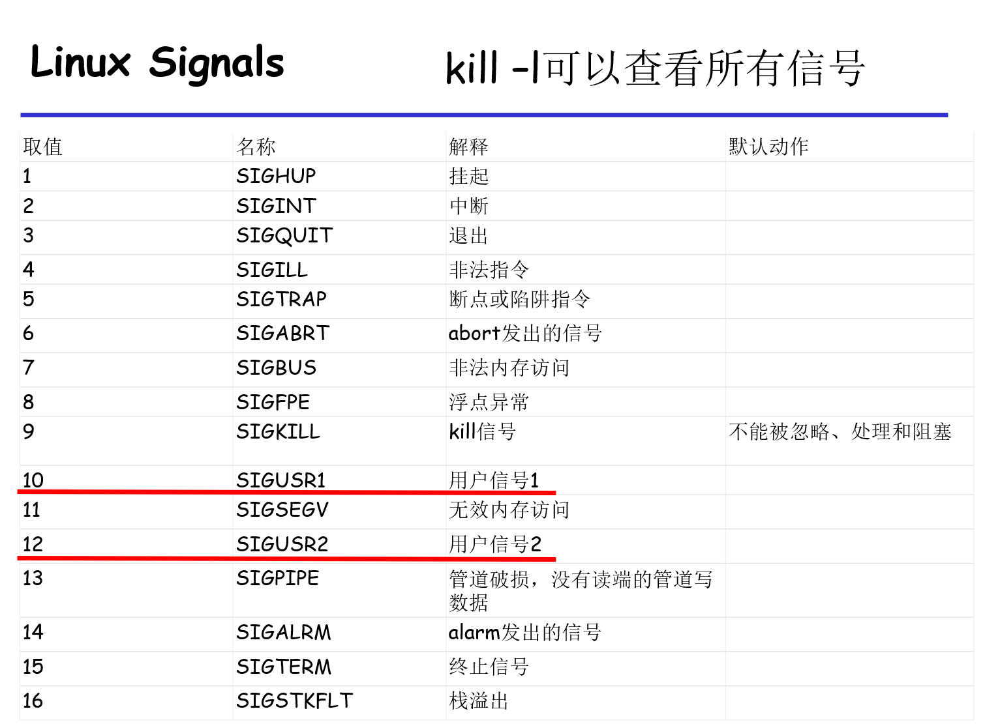
特殊：10和12要由用户自定义
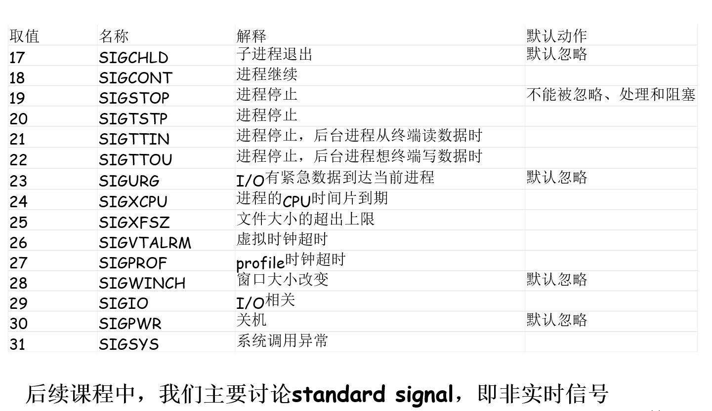


2. Two steps to transfer a signal to a destination process：Sending a signal  Receiving a signal
    1. Sending a signal
        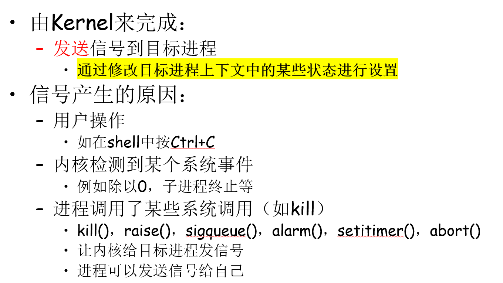
        
    2. Receiving a signal
        - 目标进程接收信号的时机
            - 当进程从内核态刚切换到用户态时会检查并接受信号；
                - 检查信号在内核态完成，处理信号在用户态完成，所以是在边界
                - （稍后讲接受signal的机制）
            - 在内核态，信号不起作用；
            - 在用户态，所有未被屏蔽的信号都处理完毕；
        
        - 对于收到的信号，进程可以有4种处理方式：（1，4常见）
            - Ignore the signal (e.g., SIGCHILD)
            - Terminate (e.g., SIGKILL)
            - Stop (e.g., SIGSTOP) or restart (SIGCONT)
            - Catch the signal 
                - by executing a user-level function called signal handler（通常由用户编写，也有系统默认）
            
        - 对于我们讨论的对象，非实时信号standard signal, 不是real-time signal，具有一下特性：
            - Only one
                某一时刻，某种类型最多有一个pending signal
            - Not queued
                - 如果一个进程已经有一个类型 k的pending signal，之后发送的signal k不会排队，而是直接被丢弃.
        - Pending Signal
            已经发送，但还没有接受的信号，叫做pending signal

        - Blocking a Signal
            - 进程可以选择性block特定信号的接收
            - 当一个信号被block时
                - 可以发送
                - 但是pending signal不会被接受
                - 直到该进程unblock这种signal
        - 上面的情况在Internal Data Structures中的表现：
                    
    
    3. Process Groups
        
        ```c
        #include <unistd.h>
        pid_t getpgrp(void);
        // returns: process group ID of the calling process
        #include <unistd.h>
        pid_t setpgid(pid_t pid, pid_t pgid);
        // returns: 0 on success, -1 on error
        ```
        - setpgid
            - 把进程pid的进程组设置为pgid
            - 如果pid=0, 那就是指当前进程
            - 如果pgid=0，那就是用pid作为进程组ID
                - 相当于“自立门户”
        
    
    4. kill
    
    
    ps:查看进程状态
    

    5. Sending Signals from the Keyboard
    - Job
        - Linux/Unix中一个shell __命令__ 所创建的进程集合
        - 某一时刻最多有有一个 foreground job，以及0个或多个 background job
        - Shell会为每个job创建一个process group

        通常，process group ID 来自job中的某个parent process
        
        e.g.
        ```bash
        unix> ls | sort
        # a foreground job consisting of two processes connected by a pipe
        # pipe 通过 | 实现
        ```
        
        shell创建的Job自立门户，其他进程的子进程会和父进程在一个group
    - ctrl-c
    
    - ctrl-z
    
    挂起，不会释放内存，不占用cpu
    
    w参数：宽输出
    +：表示该进程正处于前台运行
    
    6. Sending Signals with kill Function
    ```c
    #include <sys/types.h>
    #include <signal.h>
    int kill(pid_t pid, int sig);
    //returns: 0 if OK, -1 on error
    /*
        If pid is greater than zero,
        - then the kill function sends signal number sig to process pid
        If pid is less than zero
        - then kill sends signal sig to every process in process group abs(pid)
    */
    ```

    7. Receiving a Signal
    
    也可以同在进程A中
    
    

    - 嵌套信号处理
    
    在信号嵌套中，信号 $t$ 的产生发生在信号 $s$ 的 Handler 执行期间。发送与检查动作始终发生在内核态，而 Handler 的执行始终发生在用户态。

    - 处理方式：
    Each signal type has a predefined default action, which is one of the following:
        - The process terminates.
        - The process terminates and dumps core.
        - The process stops until restarted by a SIGCONT signal
        - The process ignores the signal
        
        
    
    __Signal Function__
    ```c
    #include <signal.h>
    typedef void (*signalhandler_t)(int);//一个指向『参数为 int，返回值为 void』的函数的指针
    signalhandler_t signal(int signum, signalhandler_t *handler)
    //returns: ptr to previous handler（这次设置之前的） if OK, SIG_ERR on error (does not set errno)
        
    ```
    Three ways to change default actions:
        - If handler（第二个参数） is SIG_IGN, then signals of type signum are ignored
        - If handler is SIG_DFL, then the action for signals of type signum reverts to the default action（起到恢复默认的作用）
        - Otherwise, change action to handler (called signal handler)
    辨析：


    - signal函数的执行阶段
    

    在父进程为信号设置的handleer在子进程也是有效的
    8. Sending Signals With the alarm Function
    ```c
    #include <unistd.h>
    unsigned int alarm(unsigned int secs);
    //returns: remaining secs of previous alarm, or 0 if no previous alarm
    ```
    Arranges(安装) for the kernel to send a SIGALRM signal to the calling process in secs seconds (给自己设个闹钟)
    - If secs is zero，any pending alarm is canceled (取消所有闹钟) 
    - The call to alarm（调用时） 
        - 取消掉任何待处理的（pending）闹钟
        - 返回前一个pending alarm剩余的秒数
        - 如果之前没有pending alarm，返回0
        - 根据参数设置新的闹钟

    e.g.


    9. 编写signal hander的要求
        - 编写简短、逻辑简单的signal handler
        - 在signal handler中只调用async-signal-safe functions
            - 可重入(reentrant)或者不能被signal中断的函数
        - 在handler中保存errno，并在返回前恢复errno
            - 避免handler中对error的修改影响其他程序
        - 如要访问全局数据结构，应block其他signal
        - 将全局变量声明为volatile和原子变量
    
    
    10. sigaction Function
    
    基于sigaction的更安全的Signal函数实现：
    ```c
    handler_t *Signal(int signum, handler_t *handler)
    {
        // 声明两个结构体：action 用于设置新的信号行为，old_action 用于接收保存旧的信号行为
        struct sigaction action, old_action; 

        // 1. 绑定处理函数：将用户传入的函数指针（handler）赋给新的信号处理动作
        action.sa_handler = handler;         

        /* block sigs of type being handled */
        // 2. 清空信号掩码：这意味着在当前信号处理函数执行期间，除了该信号本身会被系统默认阻塞外，不会去主动阻塞其他类型的信号
        sigemptyset(&action.sa_mask);        

        /* restart syscalls if possible */
        // 3. 设置重启标志：这是最关键的一步。如果进程在执行 read/wait 等慢速系统调用时被该信号打断，处理完信号后系统会自动重新启动该系统调用，而不是直接报错返回 EINTR
        action.sa_flags = SA_RESTART;        

        // 4. 执行注册：调用底层的 sigaction 函数。
        // 将 signum 信号的处理动作设置为 action，同时把以前的旧动作保存到 old_action 指针指向的内存中
        if (sigaction(signum, &action, &old_action) < 0)
            unix_error("Signal error");      // 如果 sigaction 调用失败（返回值小于0），则调用自定义的错误包装函数报错并退出

        // 5. 返回旧状态：将保存下来的旧信号处理函数指针返回。这完美模拟了 C 标准库中原生 signal() 函数的返回值行为
        return (old_action.sa_handler);      
    }
    ```
    - 只有正在被处理的信号类型被屏蔽，同类型信号无法嵌套
    - 在所有版本的signal实现中，信号都不支持排队
    - 被中断的系统调用，会在可以的时候自动重新执行
    - 一旦通过signal函数注册信号对应的处理函数，只有当再次调用signal函数，并将handler指定为SIG_IGN或SIG_DFL才能取消
        - SIG_IGN：忽略信号
        - SIG_DFL：恢复默认处理方式
    
    signal()：不支持信号传递信息，主要用于非实时信号安装；
    sigaction():支持信号传递信息，可用于所有信号安装；
    用信号传递数据性能很有限，一般不推荐。
        
    11. Explicitly Blocking Signals
    
    __sigprocmask__
    改变当前屏蔽信号集合（blocked bit vector）的状态
    - SIG_BLOCK: add the signals in set to blocked (blocked = blocked | set )
    - SIG_UNBLOCK: Remove the signals in set from blocked (blocked = blocked & ~set)
    - SIG_SETMASK: blocked = set
    - If oldset is non-NULL, the previous value of the blocked bit vector is stored in oldset
    
    __Signal set__
    - Sigemptyset：将set每一个bit设置为0
    - Sigfillset ：将set每一个bit设置为1
    - Sigaddset ：在set中增加一个屏蔽信号
    - Sigdelset：在set中删除一个屏蔽信号
    e.g.

    

     

    12. Explicitly Waiting for Signals
    - Program is correct, but very wasteful
    ```c
    volatile sig_atomic_t pid;
    
    void sigchld_handler(int s)
    {
        int olderrno = errno;
        pid = Waitpid(-1, NULL, 0); /* Main is waiting for nonzero pid */
        errno = olderrno;
    }
    
    void sigint_handler(int s)
    {
    }
    int main(int argc, char **argv) {
        sigset_t mask, prev;
        Signal(SIGCHLD, sigchld_handler);
        Signal(SIGINT, sigint_handler);
        Sigemptyset(&mask);
        Sigaddset(&mask, SIGCHLD);
    
        while (1) {
        Sigprocmask(SIG_BLOCK, &mask, &prev); /* Block SIGCHLD */
        if (Fork() == 0) /* Child无论何时，无论何地，只要一个子进程终止了操作系统内核都会立刻、自动地向它的父进程发送一个*/
            exit(0);
        /* Parent */
        pid = 0;
        Sigprocmask(SIG_SETMASK, &prev, NULL); /* Unblock SIGCHLD */
    
        /* Wait for SIGCHLD to be received (wasteful!) ，会被signal打断*/
        while (!pid);// 忙等 busy wait
        /* Do some work after receiving SIGCHLD */
        printf(".");
        }
        exit(0);
    }
    ```
    
    - sigsuspend
    ```c
    int sigsuspend(const sigset_t *mask)
    // e.g.
    sigprocmask(SIG_SETMASK, &mask, &prev);
    pause();
    sigprocmask(SIG_SETMASK, &prev, NULL);    
    ```
    


## CPU 调度
1. 调度策略
    1. First In, First Out (FIFO)
         
    2. Shortest Job First (SJF)
         
    3. Shortest Time-to-Completion First (STCF) 
        
        


    
     

    以上调度算法的共同问题：
        - 假设预先知道每个任务的执行时间（预约式）
        - 但实际上我们一般是没法预知的
    4. Multi-Level Feedback Queue (MLFQ)
        
        
              
        