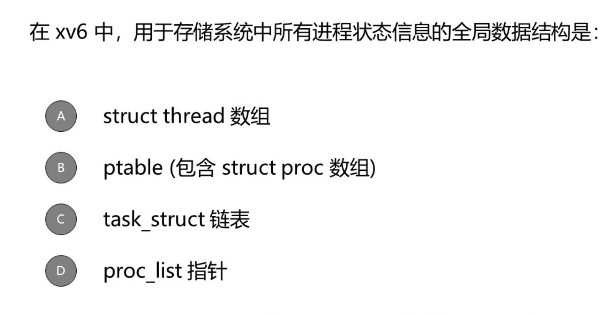
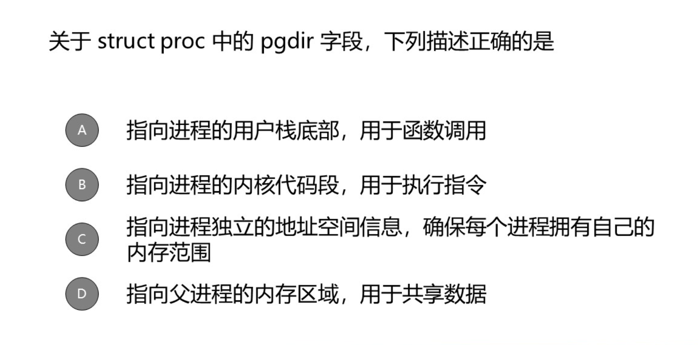
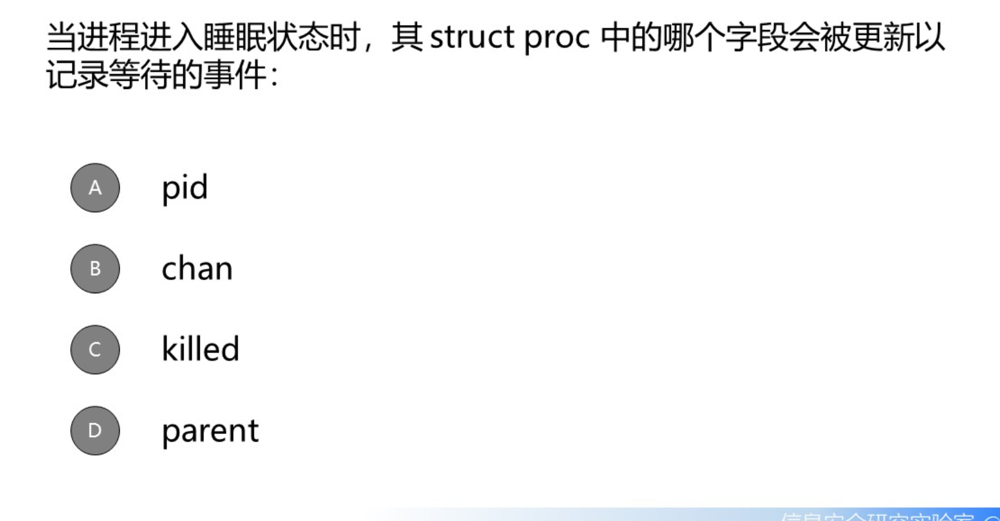
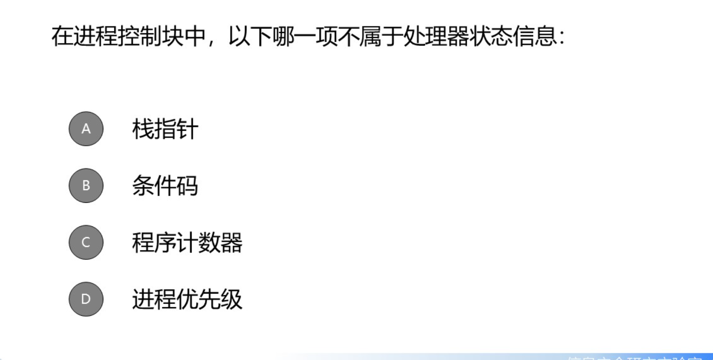
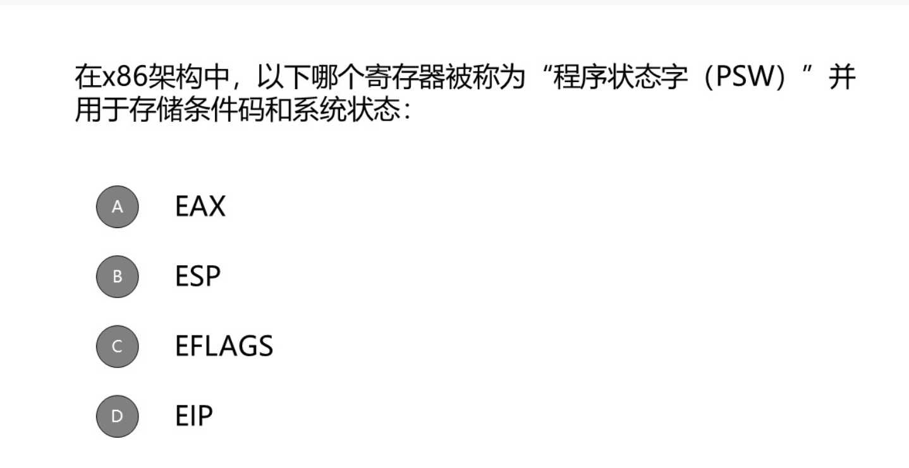
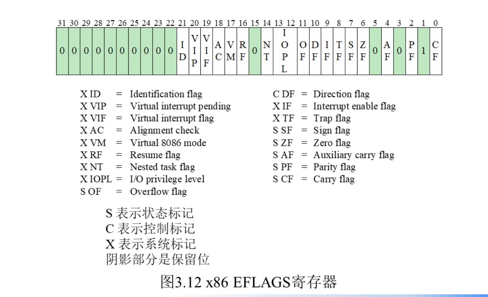
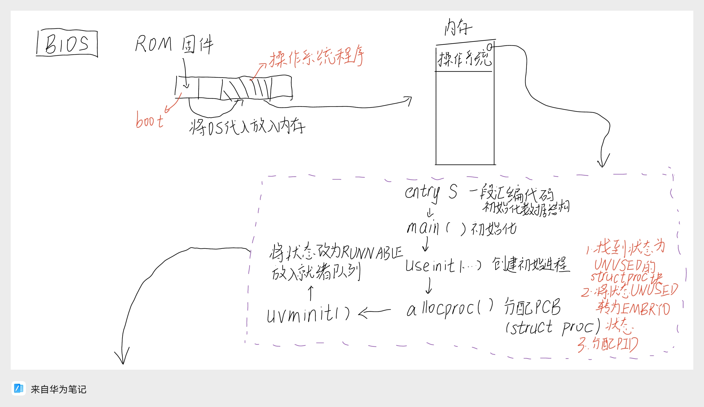

1. 硬件中断后执行操作系统代码。操作系统和程序交替执行。时间片结束都是靠TimeOut，TimeOut是一种中断
2. 操作系统频繁放弃控制权
3. 记账信息

```c
struct {
  struct spinlock lock;      // 保护进程表的自旋锁
  struct proc proc[NPROC];   // 进程数组（NPROC=64）
} ptable;
```





操作系统启动
