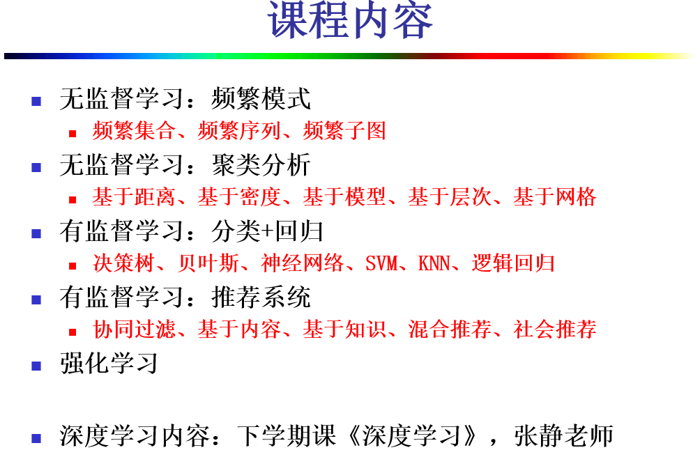
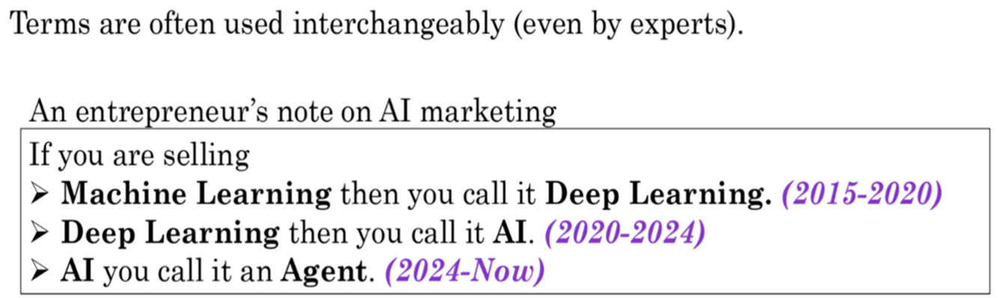
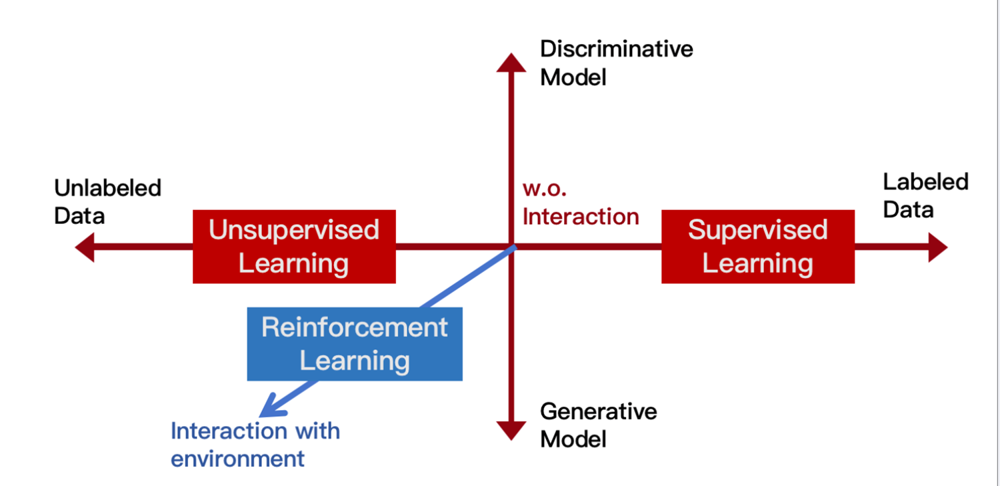
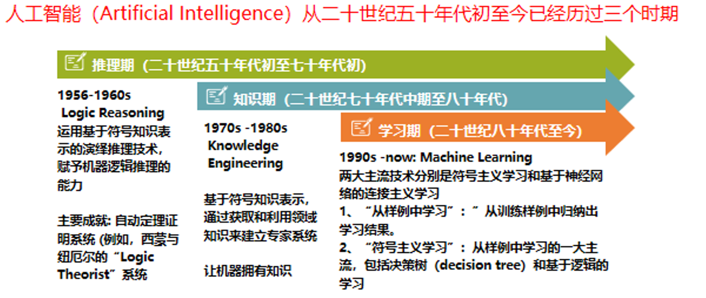
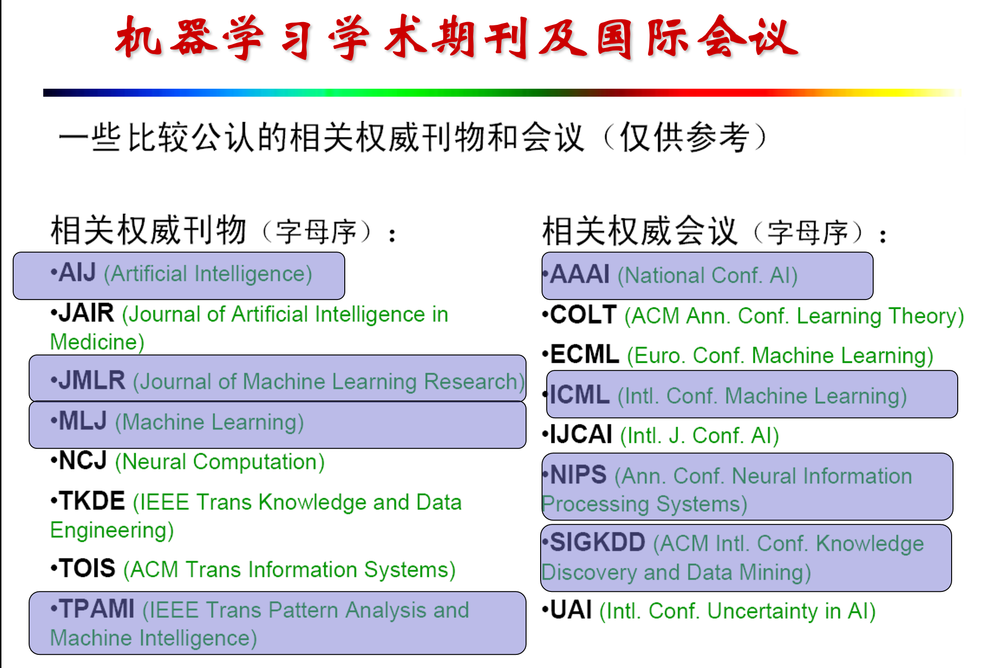
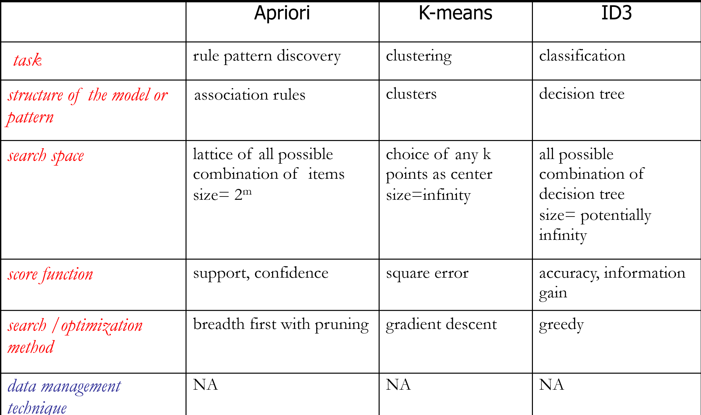

# Machine Learning

0. 考核：
    - 平时（40％）
        - 考勤（5%）
        - 期中（15%）
        - 大作业（20%）
    - 期末（60％）

1. How to decide whether to use ML?
    They should
    - exists some 'underlying pattern' to be learned
    - but no programmable (easy) definition
    - somehow there is data about the pattern

2. Artificial Intelligence Is the Goal，Machine Learning Is the Method
    
    
    
    
3. 知识框架
    1. Techniques (Course highlights)
        - Pattern Discovery
        - Cluster analysis 
        - Classifier Building
        - Regression
        - Recommendation
        - Reinforcement Learning…
    
    2. Applications
        - Customer Relationship Management (CRM)
        - Web pages Searches and Analysis 
        - Network Security
        - Robotics
        - Social Networks
        - Genomic Database…
    3. Principles(With the help of GPT and yourself)
        - Database Technology:
            - Indexing, Compression, Data Structure
        - AI/ Machine Learning
        - Statistics
        - Information Theory
        - Theoretical CS :
          - Approximate, Random, Online 
          - Algorithms
        - Mathematical Programming
        - Computational Geometry  …

4. 学习方法——**机器学习算法的组件化思想**
- Every machine learning algorithm has five components:
    $$
    \begin{aligned}
    &\text{1. 学习任务} \\[5pt]
    &\left.
    \begin{aligned}
    &\text{2. 模型（或模式）结构} \\
    &\text{3. 评分函数（损失函数，Loss函数）} \\
    &\text{4. 搜索和优化方法}
    \end{aligned}
    \right\}
    \quad \text{搜索和优化方法} \\[5pt]
    &\text{5. 数据管理策略}
    \end{aligned}
    $$
- 机器学习算法的组件化思想
        该观点强调了算法的本质，而不仅仅是算法的罗列
        每一种组件都蕴含着一些非常通用的系统原理，掌握了每一种组件的基本原理之后，再来理解由不同组件“装配”起来的算法
        当面对一个新的应用时，数据分析人员应该从组件的角度，根据应用需求，考虑应该选取哪些组件，来组成一个新的算法，而不是考虑选取哪个现成的算法。
        - 对于小的数据集，模型（模式）的解释和预测能力相对于计算效率来说可能要重要的多
        但是，随着数据集的增大，计算效率将变得越来越重要。对于海量数据，必须在模型（模式）的完备性和计算效率之间进行平衡，以期对现有数据达到某种程度的拟合。
        
        - 统计学家强调推理过程，优先关注模型（模式）、评分函数、参数估计等，将计算效率问题放在其次；而计算机科学家则更注重高效的空间搜索和数据管理
        
        
    
    1. 组件1：机器学习任务
        1. 模式学习：致力于从数据中发现模式，比如 频繁模式、异常模式……
        
        2. 模型学习
            1. 预测建模
                - 分类：被预测的变量是范畴型或者离散型（有监督的学习过程）
                - 回归：被预测的变量是数值型或者连续型
            2. 描述建模：目标是描述数据的全局特征；
            - 描述和预测的关键区别是：预测的目标是唯一的变量，如信用等级、疾病种类等，而描述并不以单一的变量为中心
            - eg: 聚类分析
    
    2. 组件2：模型(或模式)结构
    eg: 线性回归模型、决策树、关联规则、图模型、神经网络、支持向量机、层次聚类模型、集成模型、频繁序列模式……
    - 模型是对整个数据集的高层次全局性的描述或总结
    - 模式是局部的，它仅对一小部分数据做出描述，有可能只支持几个对象或对象的几个属性
    - 全局的模型和局部的模式是相互联系的。例如，为了检测出数据集内的异常对象（局部模式），需要一种对数据集内正常对象的描述（全局模型）
    - 模型和模式都有参数与之相关
        - 如：模型Y=aX+b的参数是a和b；模式（如果X>c，则Y>d的概率为p）的参数为c，d和p
        - 通常把参数不确定的模型叫做模型的结构。把参数不确定的模式叫做模式的结构（一般形式）
        - 一旦模型（模式）的参数被确定，便将这个特定的模型（模式）称为“已经拟合了的模型（模式）”，或者简称为模型（模式） 
        - 将结构拟合到数据：有了模型（模式）的结构之后，接下来的任务就是要根据数据集为模型（模式）的结构选择合适的参数值，即将结构拟合到数据
        - 由于模型（模式）的结构的参数值的评价指标是评分函数 
        
    3. 组件3：评分函数 
    - 评分函数用来对数据集与模型（模式）结构的拟合程度进行评估
    如果没有评分函数就没有办法为模型（模式）选择出一套好的参数值来。
    - 也叫损失函数（Loss）、代价函数、目标函数、优化函数、优化目标等等
    - 常用的评分函数有：
        - 似然（Likelihood）函数
        - 均方误差（MSE）
        - 准确率（Accuracy）、召回率（Recall）
        - 交叉墒（Cross Entropy）
        - 后验概率（Posterior Probability）
        - Cost/Utility
        - Margin
        - K-L Divergence
    - 在为模型（模式）选择一个评分函数时，既要能够很好地拟合现有数据，又要避免过度拟合（对极端值过于敏感），同时还要使拟合后的模型（模式）尽量简洁
    - 不存在绝对“正确”的模型（模式）；对数据的微小变化不太敏感的模型（模式）才是一个好的模型（模式）
    
    4. 组件4：搜索和优化方法 
    搜索和优化的目标是确定模型（模式）的结构及其参数值，以使评分函数达到最小值（或最大值）eg: 均方误差最小、准确率最高、似然最大……
        1. 优化问题：针对特定的模型，发现其最佳参数值的过程。如果模型（模式）的结构已经确定，则搜索将在参数空间内进行，目的是针对这个固定的模型（模式）结构，优化评分函数
            - 方法：爬山（Hill-Climing）、梯度下降（ Gradient Descent）（凸优化）、期望最大化（Expectation-Maximization, EM）、线性规划（Linear Programming）（约束优化）…
        
        2. 搜索问题：从潜在的模型（模式）族中发现最佳模型（模式）结构的过程。如果模型（模式）的结构已经确定，则搜索将在参数空间内进行，目的是针对这个固定的模型（模式）结构，优化评分函数。
            - 方法：贪婪搜索（组合优化）、分支界定、宽度（深度）优先遍历……

    5. 组件5：数据管理策略 
    针对海量数据，应该设计有效的数据组织和索引技术，或者通过采样、近似等手段，来减少数据的扫描次数，从而提高机器学习算法的效率。

    
        
    
    
            
        
        